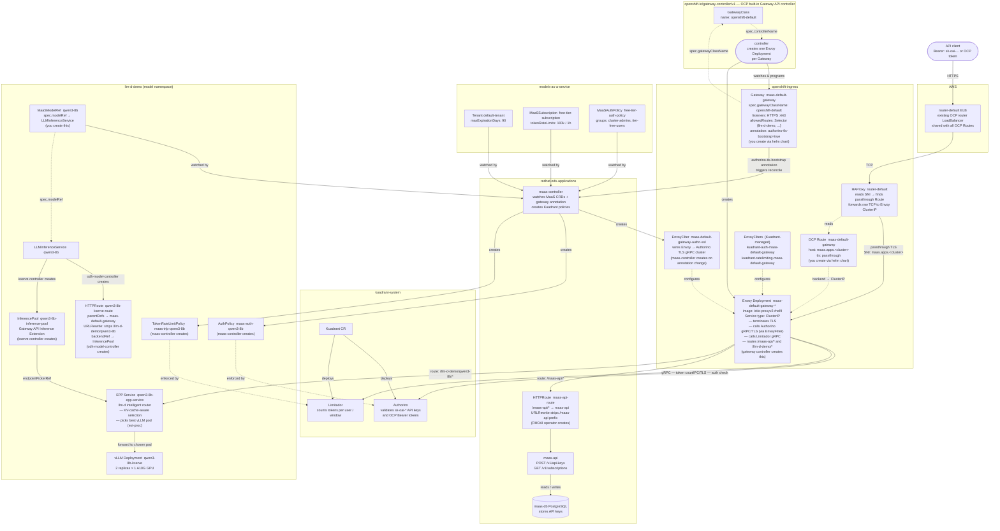

# Red Hat OpenShift AI 3.4 — Installation Manual

**Version:** 3.4 Self-Managed  
**Target Platform:** OpenShift Container Platform 4.21  
**Date:** May 2026  
**Classification:** Internal / Operations

---

## Table of Contents

1. [Overview](#1-overview)
2. [Using This Guide with Claude Code or OpenCode](#using-this-guide-with-claude-code-or-opencode)
3. [Global Prerequisites](#2-global-prerequisites)
4. [Prerequisite Operators](#3-prerequisite-operators)
5. [Installing the Red Hat OpenShift AI Operator](#4-installing-the-red-hat-openshift-ai-operator)
6. [Configuring the DataScienceCluster](#5-configuring-the-datasciencecluster)
7. [TLS Certificate Management](#6-tls-certificate-management)
8. [OpenTelemetry Observability for RHOAI](#7-opentelemetry-observability-for-rhoai)
9. [Distributed Inference with llm-d](#8-distributed-inference-with-llm-d)
10. [Model as a Service (MaaS)](#9-model-as-a-service-maas)
11. [Validation and Testing](#10-validation-and-testing)
12. [Appendix A — Quick-Reference Commands](#appendix-a--quick-reference-commands)
13. [Appendix B — Troubleshooting](#appendix-b--troubleshooting)
14. [Appendix C — Reference Links](#appendix-c--reference-links)
15. [Appendix D — MaaS with Self-Signed TLS Certificates](#appendix-d--maas-with-self-signed-tls-certificates)
16. [11. External Model MaaS Demo (Optional)](#11-external-model-maas-demo-optional)

---

## 1. Overview

Red Hat OpenShift AI (RHOAI) 3.4 is a self-managed AI/ML platform that provides an integrated environment for developing, training, serving, and monitoring models across hybrid cloud environments. This manual covers a full installation plan organized into two tiers.

**RHOAI Basic Features:**

* Dashboard
* Data Science Pipelines
* Model Serving (KServe single-model serving)
* Model Registry
* Workbenches
* TrustyAI (model monitoring and bias detection)

> **Note:** Multi-Model Serving via ModelMesh is **not supported** in RHOAI 3.x. KServe is the only supported model-serving platform from RHOAI 3.0 onwards.

**Additional Features:**

* Distributed Inference with llm-d — GA in RHOAI 3.3 (disaggregated prefill/decode, Inference Gateway, KV-cache-aware routing). **Requires OCP 4.20 or later.**
* Model as a Service — MaaS (governed, rate-limited LLM access via Gateway API and Connectivity Link)
* Llama Stack Operator (OpenAI-compatible RAG APIs and agentic AI) — *documentation in progress*

**Cross-Cutting Concerns:**

* OpenTelemetry observability (traces, metrics, and logs for RHOAI and model serving components)
* TLS certificate management (via cert-manager Operator or manual certificate generation)

> **Important:** There is no upgrade path from OpenShift AI 2.x to 3.4. This version requires a fresh installation. For distributed inference with llm-d, OCP 4.20 is required.

**Official Documentation:**

* [RHOAI 3.4 Product Documentation](https://docs.redhat.com/en/documentation/red_hat_openshift_ai_self-managed/3.4)
* [Supported Configurations for 3.x](https://access.redhat.com/articles/rhoai-supported-configs-3.x)
* [Supported Product and Hardware Configurations](https://docs.redhat.com/en/documentation/red_hat_ai/3/html/supported_product_and_hardware_configurations/index)
* [llm-d Release Component Versions](https://access.redhat.com/articles/7136620)

---

## Using This Guide with Claude Code or OpenCode

This repository includes an [`AGENTS.md`](AGENTS.md) file that gives Claude Code (and compatible tools such as OpenCode) full context about the installation phases, required environment variables, wait conditions, and known gotchas — so an AI assistant can co-pilot the deployment rather than just answer questions about it.

### What the AI assistant can do for you

* Run preflight checks and report failures before you touch anything.
* Fill in `helm template` and `oc apply` commands with your actual environment variables.
* Watch pod and operator status and tell you when it is safe to move to the next phase.
* Diagnose errors by reading command output you paste into the chat.
* Stop and ask for confirmation before any destructive or cluster-wide action (InstallPlan approvals, RBAC changes).

### How to start a session

1. Open this repository in Claude Code or OpenCode — the tool will read `AGENTS.md` automatically.
2. Make sure you are logged in to the cluster (`oc whoami`).
3. Tell the assistant which phase you are on and provide any environment variables it asks for:

   > *"I'm on Phase 0. My AWS region is `eu-west-1`. Let's start the preflight checks."*

4. After each phase the assistant will report a **human gate** — a set of conditions you need to confirm before it proceeds.

### Phase overview

| Phase | What happens | Approx. time |
| --- | --- | --- |
| 0 | Cluster validation (OCP version, admin access, StorageClass, no conflicting operators) | 5 min |
| 1 | ArgoCD + cert-manager + Let's Encrypt certificates for Ingress and API | 15–20 min |
| 2 | GPU nodes (AWS MachineSets), Node Feature Discovery, NVIDIA GPU Operator | 20–40 min |
| 3 | Connectivity Link, Leader Worker Set, RHOAI operator, DataScienceCluster | 20–30 min |
| 4 | Monitoring stack — Tempo, OpenTelemetry, Grafana | 10 min |
| 5 | llm-d Quick Start — Gateway, namespace, LLMInferenceService, curl smoke test | 15–20 min |

### Resuming after an error

Paste the failing command and its output into the chat and say which phase you were on. The assistant will diagnose the problem and suggest the next step without restarting from scratch.

---

## 2. Global Prerequisites

### 2.1 Cluster Requirements

| Requirement | Specification |
| --- | --- |
| OpenShift Container Platform | **4.20** (required for llm-d) |
| Worker nodes (base) | Minimum 2 nodes, 8 vCPU / 32 GiB RAM each |
| Single-node OpenShift | 32 vCPU / 128 GiB RAM |
| GPU nodes (model serving, llm-d) | NVIDIA A100 / H100 / H200 / A10G / L40S or AMD MI250+ |
| Architecture | x86\_64 (primary); aarch64, ppc64le, s390x also supported |
| Cluster admin access | Required for operator installation |
| OpenShift CLI (`oc`) | Installed and authenticated |
| Open Data Hub | Must **not** be installed on the cluster |

### 2.2 Storage Requirements

A default StorageClass with dynamic provisioning must be configured. Verify with:

```bash
oc get storageclass | grep '(default)'
```

S3-compatible object storage is needed for Pipelines, Model Registry, and model artifact storage (OpenShift Data Foundation, MinIO, or AWS S3).

### 2.3 Network Requirements

* Outbound access to `registry.redhat.io` and `quay.io` (or a disconnected mirror).
* For llm-d with RoCE: RDMA-capable NICs (see [Section 8.3](#83-roce-networking-optional-but-recommended-for-production)).
* DNS must be properly configured. In private cloud environments, manually configure DNS A/CNAME records after LoadBalancer IPs become available.

### 2.4 Credentials

* Hugging Face token (`HF_TOKEN`) for downloading gated model weights used with llm-d and MaaS.
* Red Hat pull secret (from [console.redhat.com](https://console.redhat.com)).

### 2.5 RHOAI operator version (stable 3.x vs 3.x early access)

The **Red Hat OpenShift AI operator** is installed from OperatorHub via a Subscription. This repository ships a Helm chart at `gitops/operators/rhoai` so you can pick the OLM **channel** and **startingCSV** without editing YAML by hand.

| Goal | OLM channel | Example `startingCSV` |
| --- | --- | --- |
| GA stable 3.4 (default for this guide) | `stable-3.x` | `rhods-operator.3.4.0` |
| 3.4 early access | `beta` | `rhods-operator.3.4.ea2` |

Early access builds are published on the **beta** channel; GA releases use **stable-3.x**. Pin the CSV you want with `startingCSV` so upgrades are predictable.

Set **`RHOAI_OLM_PROFILE`** when rendering the operator chart (defaults to stable if unset):

| `RHOAI_OLM_PROFILE` | Effect |
| --- | --- |
| `stable` (default) | `channel: stable-3.x`, `startingCSV: rhods-operator.3.4.0` |
| `ea` | `channel: beta`, `startingCSV: rhods-operator.3.4.ea2` |

You can instead edit `gitops/operators/rhoai/values.yaml` (`olmProfile` or explicit `channel` / `startingCSV`) or pass `--set olmProfile=ea` to `helm template`.

---

## 3. Prerequisite Operators

RHOAI 3.4 requires several operators installed **before** creating the DataScienceCluster. Install them via **Operators → OperatorHub** in the web console or via CLI Subscription objects.

> **Note on cert-manager:** The cert-manager Operator for Red Hat OpenShift is recommended for automating TLS certificate lifecycle across RHOAI, llm-d, OpenTelemetry, and Llama Stack. It is not a hard requirement — you can provide manually generated certificates wherever TLS is needed. That said, several components document cert-manager as a dependency in their official guides, making it the path of least resistance for most deployments.

> **Note on Service Mesh:** Do **not** install OpenShift Service Mesh 2.x under any circumstances. It is not supported in RHOAI 3.x and its CRDs conflict with the llm-d gateway component. Service Mesh 3.x is only required if you plan to deploy the **Llama Stack Operator** — it is **not** needed for base RHOAI or llm-d.

### 3.0 ArgoCD (Red Hat OpenShift GitOps)

```bash
helm template openshift-gitops ./gitops/operators/openshift-gitops | oc apply -f -
```

Wait for the CSV to reach `Succeeded`:

```bash
oc get csv -n openshift-gitops-operator --watch
```

### 3.1 Cert-Manager Operator and Let's Encrypt Certificate Issuer

> **AWS credential flow (IRSA):** On AWS, the cert-manager chart (`cloud=aws`) creates a `CredentialsRequest` in `openshift-cloud-credential-operator`. The OpenShift Cloud Credential Operator (CCO) reads this request and automatically provisions a scoped IAM credential into an `aws-creds` Secret in the `cert-manager` namespace. The Secret contains `aws_access_key_id` and `aws_secret_access_key` entries tied to a policy that allows only the Route53 actions needed for DNS-01 challenge solving (`route53:GetChange`, `ChangeResourceRecordSets`, `ListResourceRecordSets`, `ListHostedZonesByName`). No manual AWS credential input is required — CCO handles the full lifecycle. Verify the secret was provisioned: `oc get secret aws-creds -n cert-manager`.

#### Installing the operator

The chart deploys the `cert-manager-operator` and `cert-manager` namespaces, the OLM Subscription, the `CertManager` cluster configuration, monitoring RBAC and a `ServiceMonitor`, and (on AWS) a `CredentialsRequest` for Route53 access.

Set `CLOUD` to **aws** when running on AWS, or **none** for bare metal / non-AWS:

```bash
CLOUD=aws   # or "none" for bare metal / non-AWS
```

**Option A — CLI:**

```bash
for i in $(seq 1 60); do
  if helm template gitops/operators/cert-manager-operator --set cloud=${CLOUD} --name-template cert-manager | oc apply -f -; then
    break
  fi
  [[ $i -eq 60 ]] && { echo "Gave up after 60 attempts"; exit 1; }
  sleep 5
done

# Wait for CSV
oc wait --for=jsonpath='{.status.phase}'=Succeeded csv \
   -n cert-manager-operator \
   -l operators.coreos.com/openshift-cert-manager-operator.cert-manager-operator= \
   --timeout=300s
```

> **Note (two-pass apply):** The first `helm template | oc apply` will fail on the `CertManager` CR with `no matches for kind "CertManager"` because the operator CRD is not registered until the CSV reaches `Succeeded`. This is expected. Wait for the CSV, then run the same command a second time — it applies cleanly:
> ```bash
> # Wait for CSV
> oc wait --for=jsonpath='{.status.phase}'=Succeeded csv \
>   -n cert-manager-operator \
>   -l operators.coreos.com/openshift-cert-manager-operator.cert-manager-operator= \
>   --timeout=300s
> # Second pass — applies the CertManager CR
> helm template gitops/operators/cert-manager-operator --set cloud=${CLOUD} --name-template cert-manager | oc apply -f -
> ```

**Option B — ArgoCD:**

ArgoCD needs permission to manage `CredentialsRequest`, `ServiceMonitor`, and cert-manager CRDs before syncing. Apply this ClusterRole and ClusterRoleBinding first:

```bash
oc apply -f - <<EOF
apiVersion: rbac.authorization.k8s.io/v1
kind: ClusterRole
metadata:
  name: credentialsrequest-manager
rules:
- apiGroups:
  - cloudcredential.openshift.io
  resources:
  - credentialsrequests
  verbs:
  - get
  - list
  - watch
  - create
  - update
  - patch
  - delete
- apiGroups:
  - monitoring.coreos.com
  resources:
  - servicemonitors
  verbs:
  - get
  - list
  - watch
  - create
  - update
  - patch
  - delete
- apiGroups:
  - cert-manager.io
  resources:
  - clusterissuers
  - issuers
  - certificates
  - certificaterequests
  - orders
  - challenges
  verbs:
  - get
  - list
  - watch
  - create
  - update
  - patch
  - delete
---
apiVersion: rbac.authorization.k8s.io/v1
kind: ClusterRoleBinding
metadata:
  name: argocd-credentialsrequest-manager
roleRef:
  apiGroup: rbac.authorization.k8s.io
  kind: ClusterRole
  name: credentialsrequest-manager
subjects:
- kind: ServiceAccount
  name: openshift-gitops-argocd-application-controller
  namespace: openshift-gitops
EOF
```

Then create the ArgoCD Application:

```bash
cat <<EOF | oc apply -f -
  apiVersion: argoproj.io/v1alpha1
  kind: Application
  metadata:
    labels:   
      app: cert-manager-operator
    name: cert-manager-operator
    namespace: openshift-gitops
  spec:   
    destination:
      server: 'https://kubernetes.default.svc'
    project: default                                        
    source:
      path: gitops/operators/cert-manager-operator
      repoURL: https://github.com/alpha-hack-program/llm-d-guide.git
      targetRevision: main                                                                                                                       
      helm:
        values: |   
          cloud: ${CLOUD}
    syncPolicy:   
      automated:
        prune: false                                                                                                                             
        selfHeal: false                                     
EOF
```

#### Installing Let's Encrypt Cluster Issuers and certificates for OpenShift Ingress and API Server

> **Note:** Only if CLOUD==aws

```bash
# 0) Check if logged in with oc
if ! oc whoami &>/dev/null; then
  echo "Error: Not logged in to OpenShift. Please run 'oc login ...' before proceeding."
  exit 1
fi

# 1) Wait for the operator to be ready
echo -n "Waiting for cert-manager pods to be ready..."
while [[ $(oc get pods -l app.kubernetes.io/instance=cert-manager -n cert-manager \
  -o 'jsonpath={..status.conditions[?(@.type=="Ready")].status}') != "True True True" ]]; do
  echo -n "." && sleep 1
done
echo -e "  [OK]"

# 2) Detect cluster domain and AWS region
CLUSTER_DOMAIN=$(oc get dns.config/cluster -o jsonpath='{.spec.baseDomain}')
AWS_DEFAULT_REGION="${AWS_DEFAULT_REGION:=eu-west-1}"

[[ -z "${CLUSTER_DOMAIN}" ]] && { echo "Error: CLUSTER_DOMAIN could not be detected."; exit 1; }
[[ -z "${AWS_DEFAULT_REGION}" ]] && { echo "Error: AWS_DEFAULT_REGION is not set."; exit 1; }

echo "CLUSTER_DOMAIN=${CLUSTER_DOMAIN}"
echo "AWS_DEFAULT_REGION=${AWS_DEFAULT_REGION}"
```

Install the certificate issuers:

```bash
cat <<EOF | oc apply -f -
apiVersion: argoproj.io/v1alpha1
kind: Application
metadata:
  labels:
    app: cert-manager-route53
  name: cert-manager-route53
  namespace: openshift-gitops
spec:
  destination:
    server: 'https://kubernetes.default.svc'
  project: default
  source:
    path: gitops/operators/cert-manager-route53
    repoURL: https://github.com/alpha-hack-program/llm-d-guide.git
    targetRevision: main
    helm:
      parameters:
        - name: clusterDomain
          value: ${CLUSTER_DOMAIN}
        - name: route53.region
          value: ${AWS_DEFAULT_REGION}
  syncPolicy:
    automated:
      prune: false
      selfHeal: false
EOF
```

Verify certificate status:

```bash
oc get certificates.cert-manager.io --all-namespaces \
  -o custom-columns='NAMESPACE:.metadata.namespace,NAME:.metadata.name,STATUS:.status.conditions[0].type,READY:.status.conditions[0].status'
```

### 3.2 GPU and Hardware Dependencies

| Operator | Channel | Source | Purpose |
| --- | --- | --- | --- |
| Node Feature Discovery (NFD) Operator | `stable` | `redhat-operators` | Detects GPU hardware capabilities |
| NVIDIA GPU Operator | `v26.3` (latest) | `certified-operators` | GPU device plugin, drivers, DCGM |

#### Installing the operators

**Option A — CLI (recommended):**

Each directory contains an `install.sh` script that queries `oc get packagemanifest` at runtime to resolve the current default channel and CSV, so the manifests stay valid across OCP releases.

Install NFD first, wait for it to be ready, then install the NVIDIA GPU operator:

```bash
# 1. Install NFD operator (resolves channel + CSV dynamically)
bash gitops/operators/nfd/install.sh
oc get csv -n openshift-nfd -w | grep nfd

# Wait for NFD CSV to reach Succeeded
oc wait --for=jsonpath='{.status.phase}'=Succeeded csv \
  -n openshift-nfd -l operators.coreos.com/nfd.openshift-nfd= --timeout=300s

# 2. Install NVIDIA GPU operator (resolves channel + CSV dynamically)
bash gitops/operators/nvidia/install.sh
oc get csv -n nvidia-gpu-operator -w | grep gpu-operator
```

**Option B — OpenShift Console:**

Go to **Operators → OperatorHub**, search for each operator by name, and install with the channel and namespace shown in the table above.

#### Applying the instance CRs

Once both operator CSVs are `Succeeded`, create the `NodeFeatureDiscovery` and `ClusterPolicy` custom resources:

```bash
# Apply NFD instance (NodeFeatureDiscovery CR)
oc apply -k gitops/instance/nfd

# Wait for NFD labels to appear on nodes before applying ClusterPolicy
oc wait --for=condition=Established crd/nodefeaturediscoveries.nfd.openshift.io --timeout=120s

# Apply NVIDIA instance (ClusterPolicy CR)
oc apply -k gitops/instance/nvidia

# Wait for the ClusterPolicy to reach ready state (all GPU daemonsets deployed)
oc wait --for=jsonpath='{.status.state}'=ready clusterpolicy/gpu-cluster-policy --timeout=600s
```

See: [NVIDIA GPU Operator on Red Hat OpenShift Container Platform](https://docs.nvidia.com/datacenter/cloud-native/openshift/latest/index.html)

#### Adding A10G GPU nodes in AWS with MachineSets

> **Before running:** decide how many availability zones you want GPU nodes in.
> - **All 3 AZs** (`a b c`) — recommended for production; provides HA and lets the scheduler spread pods. Creates 3 MachineSets, one per AZ (each with `replicas: 1` by default = 3 GPU nodes total).
> - **Single AZ** — sufficient for a single-model test deployment; cheaper. Replace `for AZ in a b c` with `for AZ in a` (or whichever AZ your cluster uses).
>
> The `AMI_ID` must be the same RHCOS AMI used by your existing worker nodes. Retrieve it from a running MachineSet: `oc get machineset -n openshift-machine-api <name> -o jsonpath='{.spec.template.spec.providerSpec.value.ami.id}'`

```bash
export INFRA_ID=$(oc get infrastructure cluster -o jsonpath='{.status.infrastructureName}')
export AWS_REGION="${AWS_REGION:=eu-west-1}"
# Get the RHCOS AMI from an existing worker MachineSet:
export AMI_ID=$(oc get machineset -n openshift-machine-api \
  -o jsonpath='{.items[0].spec.template.spec.providerSpec.value.ami.id}')
export AWS_INSTANCE_TYPE="${AWS_INSTANCE_TYPE:=g5.2xlarge}"
export AWS_INSTANCES_PER_AZ=${AWS_INSTANCES_PER_AZ:=1}

echo "INFRA_ID=${INFRA_ID}, AWS_REGION=${AWS_REGION}, AMI_ID=${AMI_ID}, AWS_INSTANCE_TYPE=${AWS_INSTANCE_TYPE}"

# All 3 AZs (production). Change to "for AZ in a" for a single-AZ test setup.
for AZ in a b c; do
  helm template gpu-worker ./gitops/instance/machine-sets/gpu-worker \
    --set infrastructureId="${INFRA_ID}" \
    --set region=${AWS_REGION} \
    --set instanceType=${AWS_INSTANCE_TYPE} \
    --set amiId="${AMI_ID}" \
    --set devicePluginConfig="" \
    --set az=${AZ} | oc apply -f -
done
```

### 3.3 Core Dependencies (All Installations)

| Operator | Channel | Purpose | Required For |
| --- | --- | --- | --- |
| Red Hat — Authorino Operator | `managed-services` | Token auth for single-model serving endpoints | KServe / llm-d |
| cert-manager Operator for Red Hat OpenShift | `stable-v1` | Automated TLS certificate lifecycle | Recommended (see above) |
| Red Hat Build of Kueue | `stable` | Distributed workload quota and scheduling | GPUaaS / Distributed Workloads only (**not** required for llm-d) |
| Red Hat OpenShift Leader Worker Set Operator | `stable` | Multi-node leader/worker pod sets | llm-d (required) |

> **Note on Serverless:** The Red Hat OpenShift Serverless operator (Knative Serving) is **not required** for RHOAI 3.x. It was a prerequisite for the legacy KServe serverless mode in RHOAI 2.x, but RHOAI 3.x uses KServe in raw deployment mode by default and does not require Serverless.

> **Note on Service Mesh 3.x:** Install OpenShift Service Mesh 3.x **only** if you intend to use the Llama Stack Operator. It is not a prerequisite for llm-d or base RHOAI model serving.

```bash
# 1. Connectivity Link (RHCL operator — Authorino + Limitador + Kuadrant CRDs)
oc apply -k ./gitops/operators/connectivity-link
# InstallPlan may require manual approval due to dependencies
oc get installplan -n openshift-operators | grep -i "requiresapproval"
# If an InstallPlan is pending, approve it:
# oc patch installplan <NAME> -n openshift-operators --type merge -p '{"spec":{"approved":true}}'
oc get csv -n openshift-operators -w | grep -E "rhcl|authorino|limitador"
# Wait for AuthPolicy CRD
oc wait --for=condition=Established crd/authpolicies.kuadrant.io --timeout=300s

# 1b. Create the Kuadrant CR — instantiates the Authorino and Limitador operands.
#     Required for MaaS auth and rate-limiting enforcement.
#     On OCP 4.19+ no Service Mesh is needed; restart the operator pod if it stays Not Ready.
helm template gitops/instance/maas/connectivity-link \
  --name-template maas-connectivity-link | oc apply -f -
oc wait kuadrant kuadrant -n kuadrant-system --for=condition=Ready --timeout=5m

# 2. Leader Worker Set (required for llm-d multi-node deployments)
# Apply in a loop to work around potential CRD install race conditions
until oc apply -k ./gitops/operators/leader-worker-set; do
  echo "Waiting for LeaderWorkerSet CRD to become available..."
  sleep 10
done
oc wait --for=condition=Established crd/leaderworkersetoperators.operator.openshift.io --timeout=300s
oc get csv -n openshift-lws-operator -w | grep -E "leader-worker-set"

# 3. Red Hat OpenShift AI Operator
# Choose olmProfile: "stable" (GA, stable-3.x) or "ea" (Early Access, beta channel).
# Before applying, verify startingCSV matches the live packagemanifest:
#   oc get packagemanifest rhods-operator -n openshift-marketplace \
#     -o jsonpath='{.status.channels[?(@.name=="<channel>")].currentCSV}'
# If you need to switch channels after a first install, delete the Subscription and CSV first:
#   oc delete subscription rhods-operator -n redhat-ods-operator
#   oc delete csv <previous-csv> -n redhat-ods-operator
RHOAI_OLM_PROFILE="${RHOAI_OLM_PROFILE:-stable}"
helm template rhoai-operator ./gitops/operators/rhoai \
  --set olmProfile="${RHOAI_OLM_PROFILE}" | oc apply -f -
oc get csv -n redhat-ods-operator -w | grep -E "rhods"

# 4. Configure OpenShift AI (DSCInitialization and DataScienceCluster)
oc wait --for=condition=Established crd/dashboards.components.platform.opendatahub.io --timeout=600s
# Render and apply (chart emits resources across multiple namespaces).
# Note: OdhDashboardConfig CRD may not be ready on the first pass. If the apply fails on
# OdhDashboardConfig, wait for the CRD and re-run:
#   oc wait --for=condition=Established crd/odhdashboardconfigs.opendatahub.io --timeout=120s
helm template rhoai ./gitops/instance/rhoai | oc apply -f -

# Wait for LLMInferenceService CRD and controller pods
oc wait --for=condition=Established crd/llminferenceservices.serving.kserve.io --timeout=300s
oc wait --for=condition=ready pod -l control-plane=odh-model-controller \
  -n redhat-ods-applications --timeout=300s
oc wait --for=condition=ready pod -l control-plane=kserve-controller-manager \
  -n redhat-ods-applications --timeout=300s

# 5. Monitoring stack
# a) Tempo Operator (distributed tracing)
oc apply -k gitops/operators/tempo-operator
oc get csv -n openshift-operators -w | grep -E "tempo"

# b) OpenTelemetry Operator
oc apply -k gitops/operators/opentelemetry-operator
oc get csv -n openshift-operators -w | grep -E "opentelemetry"
oc wait --for=condition=Established crd/instrumentations.opentelemetry.io --timeout=120s

# c) Grafana Operator (optional — for custom dashboards)
oc apply -k gitops/operators/grafana-operator
oc get csv -n grafana-operator -w | grep -E "grafana"
oc wait --for=jsonpath='{.status.phase}'=Succeeded csv -n grafana-operator \
  -l operators.coreos.com/grafana-operator.grafana-operator= --timeout=300s
```

#### Optional — Red Hat Build of Kueue (GPUaaS / Distributed Workloads only)

> ⚠️ **Do NOT install** unless you specifically need GPUaaS or distributed workload queue management
> (Ray, PyTorch distributed training). Installing Kueue causes the RHOAI dashboard to label all
> new projects with `kueue.openshift.io/managed=true`. Projects with this label only see hardware
> profiles with `scheduling.type: Queue` — standard `Node`-type profiles become invisible unless
> matching `Queue`-type profiles and LocalQueues are also configured.
>
> **Known issue:** The dashboard does not reload its configuration when `disableKueue`
> is toggled in `OdhDashboardConfig`. Restart the dashboard after any change:
> `oc rollout restart deployment/rhods-dashboard -n redhat-ods-applications`

```bash
# OPTIONAL — only for GPUaaS / distributed workloads
oc apply -k gitops/operators/kueue-operator
oc get csv -n openshift-operators -w | grep -E "kueue"
```

```bash
# OPTIONAL — wait for Kueue CRDs before configuring ClusterQueue
oc wait --for=condition=Established crd/clusterqueues.kueue.x-k8s.io --timeout=600s
oc wait --for=condition=Established crd/resourceflavors.kueue.x-k8s.io --timeout=600s
oc wait --for=condition=Established crd/localqueues.kueue.x-k8s.io --timeout=600s
```

```bash
# OPTIONAL — set Kueue to Managed in the DataScienceCluster after operator is ready
oc patch datasciencecluster default-dsc \
  --type='merge' \
  -p '{"spec":{"components":{"kueue":{"managementState":"Managed","defaultClusterQueueName":"default","defaultLocalQueueName":"default"}}}}'
```

```bash
# OPTIONAL — minimal ClusterQueue + ResourceFlavor setup
cat <<EOF | oc apply -f -
apiVersion: kueue.x-k8s.io/v1beta1
kind: ResourceFlavor
metadata:
  name: default-flavor
---
apiVersion: kueue.x-k8s.io/v1beta1
kind: ClusterQueue
metadata:
  name: default
spec:
  namespaceSelector: {}
  resourceGroups:
  - coveredResources: ["cpu", "memory", "nvidia.com/gpu"]
    flavors:
    - name: default-flavor
      resources:
      - name: cpu
        nominalQuota: "64"
      - name: memory
        nominalQuota: "256Gi"
      - name: nvidia.com/gpu
        nominalQuota: "8"
EOF
```

```bash
# OPTIONAL — create a LocalQueue in each Kueue-managed namespace
cat <<EOF | oc apply -f -
apiVersion: kueue.x-k8s.io/v1beta1
kind: LocalQueue
metadata:
  name: default
  namespace: <your-namespace>
spec:
  clusterQueue: default
EOF
```

```bash
# OPTIONAL — Queue-type hardware profile for Kueue-managed namespaces
# (Node-type profiles are invisible in namespaces with kueue.openshift.io/managed=true)
cat <<EOF | oc apply -f -
apiVersion: infrastructure.opendatahub.io/v1
kind: HardwareProfile
metadata:
  name: default-cpu-queue
  namespace: redhat-ods-applications
  annotations:
    opendatahub.io/display-name: "Default CPU (Kueue)"
    opendatahub.io/disabled: "false"
spec:
  identifiers:
  - displayName: CPU
    identifier: cpu
    minCount: 1
    maxCount: 4
    defaultCount: 2
    resourceType: CPU
  - displayName: Memory
    identifier: memory
    minCount: 2Gi
    maxCount: 8Gi
    defaultCount: 4Gi
    resourceType: Memory
  scheduling:
    type: Queue
    queue:
      localQueueName: default
EOF
```

### 3.4 Pipeline Dependencies

| Operator | Channel | Purpose |
| --- | --- | --- |
| Red Hat OpenShift Pipelines | `latest` | Tekton pipelines for data science workflows |

> **Note:** The OpenShift Pipelines operator is optional for llm-d. It is required only if you plan to use Data Science Pipelines features in RHOAI.

```bash
oc apply -k gitops/operators/pipelines

# If the InstallPlan requires manual approval (YOU MAY NEED TO WAIT FOR SOME MINS TO SEE THE INSTALLPLAN!!):
INSTALLPLAN_NAME=$(oc get installplan -n openshift-operators -o json | \
  jq -r '.items[] | select(.spec.clusterServiceVersionNames[]? | contains("openshift-pipelines-operator-rh")) | .metadata.name')
oc patch installplan "$INSTALLPLAN_NAME" -n openshift-operators \
  --type merge --patch '{"spec":{"approved":true}}'

oc get csv -n openshift-operators -w | grep -E "pipelines"
```

### 3.5 Check Operators

```bash
./scripts/check-operators.sh
```

---

# Quick Start Guide to Deploy llm-d

Deploy llm-d on a connected OpenShift 4.21 cluster with RHOAI 3.4.

> **Prerequisites:** Complete all steps in Section 3 before proceeding. In particular, confirm that the `LLMInferenceService` CRD is available (`oc get crd llminferenceservices.serving.kserve.io`) and that both `odh-model-controller` and `kserve-controller-manager` pods are Running in `redhat-ods-applications`.

## Step 1: Configure the Gateway

Create the GatewayClass and Gateway for llm-d.

**Using a LoadBalancer with a pre-existing certificate:**

```bash
APP_NAME=gateway
GATEWAY_NAME=${GATEWAY_NAME:=openshift-ai-inference}
CLUSTER_DOMAIN=$(oc get ingresses.config.openshift.io cluster -o jsonpath='{.spec.domain}')
echo "CLUSTER_DOMAIN=${CLUSTER_DOMAIN}"

helm template gitops/instance/llm-d/gateway \
  --name-template ${APP_NAME} \
  --set gatewayName="${GATEWAY_NAME}" \
  --set clusterDomain="${CLUSTER_DOMAIN}" \
  --set subdomain=inference \
  --set useOpenShiftRoute=false \
  --set tls.secretName=ingress-certs \
  --include-crds | oc apply -f -
```

**Using OpenShift router and generating a self-signed certificate**

```bash
APP_NAME=gateway
GATEWAY_NAME=${GATEWAY_NAME:=openshift-ai-inference}
CLUSTER_DOMAIN=$(oc get ingresses.config.openshift.io cluster -o jsonpath='{.spec.domain}')
echo "CLUSTER_DOMAIN=${CLUSTER_DOMAIN}"

helm template gitops/instance/llm-d/gateway \
  --name-template ${APP_NAME} \
  --set gatewayName="${GATEWAY_NAME}" \
  --set clusterDomain="${CLUSTER_DOMAIN}" \
  --set subdomain=inference \
  --set useOpenShiftRoute=true \
  --set tls.secretName="${GATEWAY_NAME}" \
  --set tls.generate=true --include-crds | oc apply -f -
```

> **Other gateway configurations:** See `gitops/instance/llm-d/gateway/README.md` for alternative setups (bare metal, self-signed certs, OpenShift Routes).

Verify the Gateway is ready:

```bash
oc get gateway -n openshift-ingress

# Expected output:
# NAME                              CLASS                            PROGRAMMED   AGE
# openshift-ai-inference            openshift-ai-inference-class     True         ...
```

### How the pieces connect


- **GatewayClass** declares which controller manages Gateways with this class name. One per cluster.
- **Gateway controller** (`openshift.io/gateway-controller/v1`) reacts to the Gateway CR by creating a dedicated **Envoy Deployment** (`istio-proxyv2-rhel9`) and a **LoadBalancer Service** (→ AWS ELB) in `openshift-ingress`. It does **not** touch the existing HAProxy `router-default`.
- **Envoy pod** is the actual data-plane proxy: it terminates TLS, matches the HTTPRoute path rules, rewrites the URL prefix (strips `/llm-d-demo/qwen3-8b` before forwarding), and calls the EPP via the ext-proc protocol to pick a backend pod.
- **HTTPRoute** is created automatically by `odh-model-controller`. Its `backendRefs` point to an **`InferencePool`**, not a plain `Service`.
- **InferencePool** is a Gateway API Inference Extension resource. It tells the Envoy data plane to delegate endpoint selection to the **EPP (Endpoint Picker Pod)** rather than using standard round-robin load balancing.
- **EPP** is a sidecar in the workload Deployment. It implements llm-d's intelligent routing: KV-cache-aware selection, prefill/decode disaggregation, and load-aware scheduling. Envoy calls it per-request via ext-proc and EPP replies with the address of the chosen vLLM pod.
- **LLMInferenceService** is the only resource you manage — the kserve controller and `odh-model-controller` reconcile everything else automatically.

## Step 2: Create Namespace

```bash
PROJECT="llm-d-demo"

oc new-project ${PROJECT}
oc label namespace ${PROJECT} modelmesh-enabled=false opendatahub.io/dashboard=true
```

## Step 3: Deploy an LLMInferenceService

### Option A — Qwen3-8B-FP8 via OCI ModelCar (recommended for air-gapped / registry-cached deployments)

Create a values override file:

```bash
cat <<EOF > qwen3-8b-fp8-dynamic-oci.tmp.yaml
deploymentType: intelligent-inference
serviceName: qwen3-8b
replicas: 2
useStartupProbe: true
storage:
  type: oci
  uri: oci://registry.redhat.io/rhelai1/modelcar-qwen3-8b-fp8-dynamic:1.5
model:
  name: alibaba/qwen3-8b
resources:
  limits: { cpu: "4", memory: 16Gi, gpuCount: "1" }
  requests: { cpu: "1", memory: 8Gi, gpuCount: "1" }
env:
  - name: VLLM_ADDITIONAL_ARGS
    value: "--disable-uvicorn-access-log --enable-auto-tool-choice --tool-call-parser hermes"
EOF
```

Render and apply:

```bash
helm template gitops/instance/llm-d/inference \
  --name-template qwen3-8b -n ${PROJECT} \
  -f gitops/instance/llm-d/inference/values.yaml \
  -f qwen3-8b-fp8-dynamic-oci.tmp.yaml \
  --include-crds | oc apply -f -
```

### Option B — Facebook OPT-125m via HuggingFace (quick test with a small public model)

```bash
cat <<EOF > facebook-opt-125m-hf.tmp.yaml
deploymentType: intelligent-inference
serviceName: opt-125m
replicas: 1
useStartupProbe: true
storage:
  type: hf
  uri: hf://facebook/opt-125m
model:
  name: facebook/opt-125m
resources:
  limits: { cpu: "2", memory: 8Gi, gpuCount: 1 }
  requests: { cpu: "1", memory: 4Gi, gpuCount: 1 }
EOF

helm template gitops/instance/llm-d/inference \
  --name-template opt-125m -n ${PROJECT} \
  -f gitops/instance/llm-d/inference/values.yaml \
  -f facebook-opt-125m-hf.tmp.yaml \
  --include-crds | oc apply -f -
```

> **HuggingFace access:** If using a gated model, ensure your `HF_TOKEN` secret is configured in the namespace before deploying.

## Step 4: Verify Deployment

### Check LLMInferenceService status

```bash
oc get llminferenceservice -w -n ${PROJECT}

# Expected output:
# NAME       URL                                                    READY   AGE
# qwen3-8b   https://<gateway-url>/${PROJECT}/qwen3-8b             True    5m
```

### Check pods

```bash
oc get pods -w -n ${PROJECT}

# Expected output:
# NAME                                            READY   STATUS    AGE
# qwen3-8b-kserve-xxxxx-xxxxx                    1/1     Running   3m
# qwen3-8b-kserve-xxxxx-xxxxx                    1/1     Running   3m
# qwen3-8b-kserve-router-scheduler-xxxxx         1/1     Running   3m
```

### Watch pod logs

```bash
# vLLM server logs
oc logs -f \
  -l app.kubernetes.io/name=qwen3-8b,app.kubernetes.io/component=llminferenceservice-workload \
  -n ${PROJECT}

# Scheduler logs
oc logs -f \
  -l app.kubernetes.io/name=qwen3-8b,app.kubernetes.io/component=llminferenceservice-router-scheduler \
  -n ${PROJECT}
```

## Step 5: Test the Endpoint

### Get the inference URL

```bash
INFERENCE_URL=$(oc get gateway openshift-ai-inference -n openshift-ingress \
  -o json | jq -r '.spec.listeners[] | select(.name=="https").hostname')
echo "Inference URL: https://${INFERENCE_URL}"
```

### List available models

```bash
curl -s https://${INFERENCE_URL}/${PROJECT}/qwen3-8b/v1/models | jq
```

### Send a completion request

```bash
curl -s -X POST https://${INFERENCE_URL}/${PROJECT}/qwen3-8b/v1/completions \
  -H "Content-Type: application/json" \
  -d '{
    "model": "alibaba/qwen3-8b",
    "prompt": "Explain the difference between supervised and unsupervised learning.",
    "max_tokens": 50,
    "temperature": 0.7
  }' | jq '.choices[0].text'
```

### Send a chat completion request

```bash
curl -s -X POST https://${INFERENCE_URL}/${PROJECT}/qwen3-8b/v1/chat/completions \
  -H "Content-Type: application/json" \
  -d '{
    "model": "alibaba/qwen3-8b",
    "messages": [
      {"role": "system", "content": "You are a helpful assistant. Be VERY concise"},
      {"role": "user", "content": "Answer to the Ultimate Question of Life, the Universe, and Everything."}
    ],
    "max_tokens": 200,
    "temperature": 0.7
  }' | jq '.choices[0].message.content'
```

## Step 6: Deploy Monitoring (Optional)

Deploy Prometheus and Grafana for performance monitoring (TTFT, inter-token latency, KV cache hit rates, GPU utilization):

```bash
until oc apply -k gitops/instance/llm-d-monitoring; do : ; done

# Get Grafana URL
oc get route grafana -n llm-d-monitoring -o jsonpath='{.spec.host}'
```

Access Grafana with default credentials: `admin` / `admin`

---

## Quick Start Summary

| Step | Command | Verification |
| --- | --- | --- |
| 1. Configure Gateway | `CLUSTER_DOMAIN=$(oc get ingresses.config.openshift.io cluster -o jsonpath='{.spec.domain}'); helm template gitops/instance/llm-d/gateway --name-template gateway --set clusterDomain="${CLUSTER_DOMAIN}" --include-crds \| oc apply -f -` | `oc get gateway -n openshift-ingress` |
| 2. Create namespace | `PROJECT=llm-d-demo; oc new-project ${PROJECT}; oc label namespace ${PROJECT} modelmesh-enabled=false opendatahub.io/dashboard=true` | `oc get ns ${PROJECT}` |
| 3. Deploy model | Create override file (see Step 3), then: `helm template gitops/instance/llm-d/inference --name-template qwen3-8b -n ${PROJECT} -f gitops/instance/llm-d/inference/values.yaml -f qwen3-8b-fp8-dynamic-oci.tmp.yaml --include-crds \| oc apply -f -` | `oc get llminferenceservice -n ${PROJECT}` |
| 4. Test endpoint | `INFERENCE_URL=$(oc get gateway openshift-ai-inference -n openshift-ingress -o json \| jq -r '.spec.listeners[] \| select(.name=="https").hostname'); curl -s https://${INFERENCE_URL}/${PROJECT}/qwen3-8b/v1/models \| jq` | JSON response |

---

## Cleanup

Resources were applied with `helm template ... | oc apply -f -` (no Helm release state), so remove them by piping the same template to `oc delete -f -`:

```bash
# Remove inference deployment
helm template gitops/instance/llm-d/inference \
  --name-template qwen3-8b -n ${PROJECT} \
  -f gitops/instance/llm-d/inference/values.yaml \
  -f qwen3-8b-fp8-dynamic-oci.tmp.yaml \
  --include-crds | oc delete -f -

# Remove gateway
CLUSTER_DOMAIN=$(oc get ingresses.config.openshift.io cluster -o jsonpath='{.spec.domain}')
helm template gitops/instance/llm-d/gateway \
  --name-template gateway \
  --set clusterDomain="${CLUSTER_DOMAIN}" \
  --include-crds | oc delete -f -

# Delete namespace
oc delete ns ${PROJECT}
```

To remove only the LLMInferenceService and leave the gateway in place:

```bash
oc delete llminferenceservice qwen3-8b -n ${PROJECT}
```

---

## 9. Model as a Service (MaaS)

> **Technology Preview:** MaaS is a Technology Preview feature in RHOAI 3.4 and is not supported under production SLAs.

> **Self-signed certificates:** If your cluster uses self-signed TLS (no public CA), the MaaS dashboard pages (API keys, authorization policies) will fail unless you inject the CA into the cluster trust bundle. See [Appendix D](#appendix-d--maas-with-self-signed-tls-certificates) for the full analysis and fix steps.

MaaS provides subscription-based governed access to LLMs via `sk-oai-*` API keys, token-based rate limiting, and quota enforcement. It sits on top of KServe (llm-d runtime) and uses Kuadrant (via Red Hat Connectivity Link) for policy enforcement.

Access control is CRD-based: `MaaSSubscription` defines token rate limits per model per group, and `MaaSAuthPolicy` grants groups access to models. Users can belong to multiple subscriptions. All config lives in the `models-as-a-service` namespace and is fully GitOps-compatible.

### Architecture overview



**Solid arrows** (`→`) show creation, traffic flow, or deployment relationships.
**Dashed arrows** (`-.->`) show Kubernetes spec references and policy bindings.

> **MaaS vs llm-d gateway — key networking difference:** The llm-d gateway gets its own
> dedicated AWS ELB (LoadBalancer Service). The MaaS gateway uses a **ClusterIP** Service —
> traffic arrives via the shared OCP router (HAProxy) using a **passthrough TLS Route**, so
> HAProxy forwards raw TCP directly to the Envoy pod without decrypting it.

| Resource | Namespace | Who creates it |
|---|---|---|
| `GatewayClass`, `Gateway`, `OCP Route` | `openshift-ingress` | You (gateway chart) |
| Envoy Deployment + ClusterIP Service | `openshift-ingress` | Gateway controller (`openshift.io/gateway-controller/v1`) |
| `EnvoyFilter` `maas-default-gateway-authn-ssl` | `openshift-ingress` | `maas-controller` (on gateway annotation change) |
| `EnvoyFilter` `kuadrant-auth-*`, `kuadrant-ratelimiting-*` | `openshift-ingress` | Kuadrant operator |
| `Kuadrant` | `kuadrant-system` | You (connectivity-link chart) |
| `Authorino`, `Limitador` | `kuadrant-system` | Kuadrant operator |
| `maas-api`, `maas-controller`, `maas-db` | `redhat-ods-applications` | RHOAI operator |
| `HTTPRoute` maas-api-route | `redhat-ods-applications` | RHOAI operator |
| `Tenant`, `MaaSSubscription`, `MaaSAuthPolicy` | `models-as-a-service` | You |
| `MaaSModelRef` | `llm-d-demo` (model namespace) | You |
| `AuthPolicy`, `TokenRateLimitPolicy` | `llm-d-demo` | `maas-controller` |
| `HTTPRoute`, `InferencePool` (model) | `llm-d-demo` | `odh-model-controller` / kserve controller |

### 9.1 Prerequisites

| Requirement | Chart / Command |
| --- | --- |
| RHOAI 3.4 with `kserve: Managed` and `modelsAsService: Managed` | Step 4 below — re-apply `gitops/instance/rhoai` with `--set modelsAsService=true` **after** gateway and database are ready |
| Red Hat Connectivity Link v1.2+ installed | `gitops/operators/connectivity-link` |
| **Kuadrant CR** in `kuadrant-system` | `gitops/instance/maas/connectivity-link` |
| cert-manager Operator | `gitops/operators/cert-manager-operator` |
| LeaderWorkerSet Operator | `gitops/operators/leader-worker-set` |
| `GatewayClass` (`openshift.io/gateway-controller`) | created by `gitops/instance/maas/gateway` |
| Gateway `maas-default-gateway` in `openshift-ingress` | created by `gitops/instance/maas/gateway` |
| **PostgreSQL database** (`maas-db-config` secret in `redhat-ods-applications`) | `gitops/instance/maas/database` — Step 3 below |
| OCP 4.21 | version check: `oc version` |

### 9.2 Install Steps

**Step 1 — Kuadrant CR** (Authorino + Limitador instances):

```bash
helm template gitops/instance/maas/connectivity-link \
  --name-template maas-connectivity-link | oc apply -f -
oc wait kuadrant kuadrant -n kuadrant-system --for=condition=Ready --timeout=5m
# If it stays Not Ready with "istio/envoy gateway not installed", restart the operator pod:
# oc delete pod -n openshift-operators -l app.kubernetes.io/name=kuadrant-operator
```

**Step 2 — MaaS Gateway** (GatewayClass + Gateway + Route):

```bash
CLUSTER_DOMAIN=$(oc get ingresses.config.openshift.io cluster -o jsonpath='{.spec.domain}')
helm template gitops/instance/maas/gateway \
  --name-template maas-gateway \
  --set clusterDomain="${CLUSTER_DOMAIN}" \
  --set useOpenShiftRoute=true \
  --set tls.secretName=ingress-certs \
  --set "gateway.modelNamespaces={<your-model-namespace>}" | oc apply -f -
oc get gateway maas-default-gateway -n openshift-ingress
```

> **Important:** Every namespace that contains MaaS-published `LLMInferenceService` resources must be listed in `gateway.modelNamespaces`. If a namespace is missing, the HTTPRoute will be rejected with `NotAllowedByListeners` and the `LLMInferenceService` will show `HTTPRoutesReady: False`.

**Step 3 — MaaS Database** (PostgreSQL + `maas-db-config` secret):

The `maas-api` pod will not start without a PostgreSQL database. The chart in `gitops/instance/maas/database` deploys a PostgreSQL instance in `redhat-ods-applications` and creates the `maas-db-config` secret that `maas-api` reads for its `DB_CONNECTION_URL`.

> **Password handling:** `helm template` skips the `lookup` function, so the password cannot be auto-generated — you must provide one explicitly. Generate a random password and pass it with `--set db.password=<password>`. Keep the password; you will need it for upgrades (`helm upgrade` can reuse it via lookup, but `helm template | oc apply` cannot).

```bash
DB_PASSWORD=$(openssl rand -base64 18 | tr -d '+/=' | head -c 24)
echo "Save this DB password: ${DB_PASSWORD}"

helm template gitops/instance/maas/database \
  --name-template maas-database \
  --namespace redhat-ods-applications \
  --set db.password="${DB_PASSWORD}" | oc apply -n redhat-ods-applications -f -

# Wait for the database pod to be Ready
oc wait --for=condition=ready pod -l app=maas-db \
  -n redhat-ods-applications --timeout=120s

# Verify the secret was created
oc get secret maas-db-config -n redhat-ods-applications
```

**Step 4 — Enable MaaS in the DataScienceCluster:**

> **Why this order matters:** `modelsAsService` is kept `false` in `gitops/instance/rhoai/values.yaml` during Phase 3 (RHOAI install). The `maas-api` pod requires both the MaaS gateway (Step 2) and the database secret (Step 3) to exist before it can start. Re-apply the chart here, after both are in place.

```bash
helm template rhoai ./gitops/instance/rhoai --set modelsAsService=true | oc apply -f -

# Wait for maas-api to start
oc wait --for=condition=ready pod -l app.kubernetes.io/name=maas-api \
  -n redhat-ods-applications --timeout=120s
oc get pods -n redhat-ods-applications -l app.kubernetes.io/name=maas-api
```

**Step 4 — Configure Authorino TLS:**

This is required for the MaaS API gateway to communicate with Authorino securely. Without it, the `maas-api/v1/api-keys` endpoint returns `500 Internal Server Error`.

```bash
# 4a. Generate a serving certificate for Authorino (service-ca-operator signs it)
oc annotate service authorino-authorino-authorization \
  -n kuadrant-system \
  service.beta.openshift.io/serving-cert-secret-name=authorino-server-cert \
  --overwrite

# 4b. Enable TLS on the Authorino CR
oc patch authorino authorino -n kuadrant-system --type=merge --patch '{
  "spec": {
    "listener": {
      "tls": {
        "enabled": true,
        "certSecretRef": {"name": "authorino-server-cert"}
      }
    }
  }
}'

# 4c. Configure Authorino to validate certs using the cluster CA bundle
oc -n kuadrant-system set env deployment/authorino \
  SSL_CERT_FILE=/etc/ssl/certs/openshift-service-ca/service-ca-bundle.crt \
  REQUESTS_CA_BUNDLE=/etc/ssl/certs/openshift-service-ca/service-ca-bundle.crt
oc rollout status deployment/authorino -n kuadrant-system --timeout=90s

# 4d. Annotate the gateway — maas-controller creates an EnvoyFilter for Authorino TLS.
#     IMPORTANT: Do this AFTER steps 4a-4c, or remove+re-add the annotation to force
#     the maas-controller to reconcile and create the maas-default-gateway-authn-ssl filter.
oc annotate gateway maas-default-gateway \
  -n openshift-ingress \
  security.opendatahub.io/authorino-tls-bootstrap="true" \
  --overwrite
```

Verify:
```bash
oc get service authorino-authorino-authorization -n kuadrant-system \
  -o jsonpath='{.metadata.annotations.service\.beta\.openshift\.io/serving-cert-secret-name}'
# Expected: authorino-server-cert

oc get secret authorino-server-cert -n kuadrant-system
# Expected: kubernetes.io/tls with 2 data entries

oc get authorino authorino -n kuadrant-system -o jsonpath='{.spec.listener.tls.enabled}'
# Expected: true

oc get envoyfilter maas-default-gateway-authn-ssl -n openshift-ingress
# Expected: present (created by maas-controller after annotation)
```

**Step 5 — Bootstrap the MaaS 3.4 subscription namespace:**

MaaS 3.4 uses `Tenant`, `MaaSModelRef`, `MaaSSubscription`, and `MaaSAuthPolicy` CRs. All live in the `models-as-a-service` namespace.

```bash
# 5a. Create the namespace
oc create namespace models-as-a-service

# 5b. Create the Tenant CR — must be named exactly "default-tenant"
cat <<'EOF' | oc apply -f -
apiVersion: maas.opendatahub.io/v1alpha1
kind: Tenant
metadata:
  name: default-tenant
  namespace: models-as-a-service
spec:
  apiKeys:
    maxExpirationDays: 90
  gatewayRef:
    name: maas-default-gateway
    namespace: openshift-ingress
EOF

# 5c. Inject the DB connection URL into the maas-api deployment
oc patch deployment maas-api -n redhat-ods-applications --type=json -p='[{
  "op": "add",
  "path": "/spec/template/spec/containers/0/env/-",
  "value": {
    "name": "DB_CONNECTION_URL",
    "valueFrom": {"secretKeyRef": {"name": "maas-db-config", "key": "DB_CONNECTION_URL"}}
  }
}]'
oc rollout status deployment/maas-api -n redhat-ods-applications --timeout=60s
```

**Step 6 — Register models and create subscription/auth policies:**

For each model namespace (repeat `MaaSModelRef` for every `LLMInferenceService` you want to publish):

```bash
# 6a. Create MaaSModelRef CRs in the model namespace
cat <<'EOF' | oc apply -f -
apiVersion: maas.opendatahub.io/v1alpha1
kind: MaaSModelRef
metadata:
  name: <model-name>          # must match LLMInferenceService name
  namespace: <model-namespace>
spec:
  modelRef:
    kind: LLMInferenceService
    name: <model-name>
EOF

# 6b. Create a MaaSSubscription (token rate limits per model, per group)
cat <<'EOF' | oc apply -f -
apiVersion: maas.opendatahub.io/v1alpha1
kind: MaaSSubscription
metadata:
  name: free-tier-subscription
  namespace: models-as-a-service
spec:
  owner:
    groups:
      - name: cluster-admins
      - name: tier-free-users
  modelRefs:
    - name: <model-name>
      namespace: <model-namespace>
      tokenRateLimits:
        - limit: 100000
          window: 1h
EOF

# 6c. Create a MaaSAuthPolicy (grants groups access to models)
cat <<'EOF' | oc apply -f -
apiVersion: maas.opendatahub.io/v1alpha1
kind: MaaSAuthPolicy
metadata:
  name: free-tier-auth-policy
  namespace: models-as-a-service
spec:
  subjects:
    groups:
      - name: cluster-admins
      - name: tier-free-users
  modelRefs:
    - name: <model-name>
      namespace: <model-namespace>
EOF
```

**Step 7 — Enable the dashboard interface and MaaS auth policies:**

```bash
oc patch odhdashboardconfig odh-dashboard-config -n redhat-ods-applications --type=merge \
  -p '{"spec":{"dashboardConfig":{"genAiStudio":true,"modelAsService":true,"maasAuthPolicies":true,"vLLMDeploymentOnMaaS":true}}}'
```

> **Note:** The `maas-ui` sidecar in the dashboard discovers the MaaS API at `https://maas.<cluster-domain>/maas-api`.
> This requires the MaaS gateway OCP Route (created by the gateway chart in Step 1) to use hostname `maas.<cluster-domain>`.
> If you see 500 errors on the API keys page, verify the gateway route hostname: `oc get route maas-default-gateway -n openshift-ingress -o jsonpath='{.spec.host}'` — it must be `maas.<cluster-domain>`, not `maas-default-gateway-openshift-ingress.<cluster-domain>`. If wrong, re-apply the gateway chart.

**Verify end-to-end — generate and use an API key:**

```bash
TOKEN=$(oc whoami -t)
CLUSTER_DOMAIN=$(oc get ingresses.config.openshift.io cluster -o jsonpath='{.spec.domain}')
MAAS_GW="maas.${CLUSTER_DOMAIN}"

# Create an API key
curl -sk -X POST "https://${MAAS_GW}/maas-api/v1/api-keys" \
  -H "Authorization: Bearer ${TOKEN}" \
  -H "Content-Type: application/json" \
  -d '{"name":"my-key","expiresInDays":30}'
# Returns: {"key":"sk-oai-...","id":"...","name":"my-key","createdAt":"..."}

# Use the API key to call a model
API_KEY="sk-oai-..."
curl -sk "https://${MAAS_GW}/llm-d-demo/<model-name>/v1/chat/completions" \
  -H "Authorization: Bearer ${API_KEY}" \
  -H "Content-Type: application/json" \
  -d '{"model":"<model-name>","messages":[{"role":"user","content":"Hello"}]}'
```

### 9.3 Publish a Model to MaaS

In the RHOAI dashboard, deploy a model using the **Distributed inference with llm-d** runtime and select **Publish as MaaS endpoint** in Advanced settings. Only the llm-d runtime supports MaaS integration.

For models deployed via Helm (outside the dashboard), create the `MaaSModelRef`, `MaaSSubscription`, and `MaaSAuthPolicy` CRs manually as shown in Step 6 above.

### 9.4 Token Rate Limiting

Token limits are set per model per group in `MaaSSubscription.spec.modelRefs[].tokenRateLimits`. The maas-controller translates each subscription into a Kuadrant `TokenRateLimitPolicy` in the model namespace. Limitador enforces the limits per user (`auth.identity.userid`) using the token usage from each response.

**Allowed window units:** `s`, `m`, `h` only — days are not supported, use `24h`.

**Current limits on this cluster:**

| Model | Groups | Limit |
|---|---|---|
| `qwen3-8b` | `cluster-admins`, `tier-free-users` | 100,000 tokens / 1h |
| `opt-125m` | `cluster-admins`, `tier-free-users` | 200,000 tokens / 1h |

**Change limits** — edit the `MaaSSubscription` directly:

```bash
oc edit maassubscription free-tier-subscription -n models-as-a-service
```

Or patch a specific model's limit:

```bash
oc patch maassubscription free-tier-subscription -n models-as-a-service --type=merge -p '{
  "spec": {
    "modelRefs": [
      {
        "name": "qwen3-8b",
        "namespace": "llm-d-demo",
        "tokenRateLimits": [{"limit": 50000, "window": "1h"}]
      },
      {
        "name": "opt-125m",
        "namespace": "llm-d-demo",
        "tokenRateLimits": [{"limit": 200000, "window": "1h"}]
      }
    ]
  }
}'
```

**Stack multiple windows** on the same model (e.g. burst cap + daily cap):

```yaml
tokenRateLimits:
  - limit: 10000
    window: 1m
  - limit: 500000
    window: 24h
```

**Give different groups different limits** — create separate subscriptions, one per group:

```yaml
apiVersion: maas.opendatahub.io/v1alpha1
kind: MaaSSubscription
metadata:
  name: premium-subscription
  namespace: models-as-a-service
spec:
  owner:
    groups:
      - name: premium-group
  modelRefs:
    - name: qwen3-8b
      namespace: llm-d-demo
      tokenRateLimits:
        - limit: 1000000
          window: 1h
```

A user in multiple groups gets whichever subscription they present via the `x-maas-subscription` request header. Without that header the first matching subscription applies.

**Verify the generated policy:**

```bash
oc get tokenratelimitpolicy -n llm-d-demo
oc get tokenratelimitpolicy maas-trlp-qwen3-8b -n llm-d-demo -o yaml
```

### 9.5 MaaS Troubleshooting

| Symptom | Cause | Resolution |
| --- | --- | --- |
| `HTTPRoutesReady: False` — `NotAllowedByListeners` | Model namespace not in Gateway `allowedRoutes` | Re-apply gateway chart with `--set "gateway.modelNamespaces={<ns>}"` |
| `maas-api` pod not starting | Kuadrant CR not Ready or `maas-default-gateway` missing | Check `oc get kuadrant -n kuadrant-system` and `oc get gateway maas-default-gateway -n openshift-ingress` |
| Kuadrant CR `Ready: False` — `MissingDependency` on OCP 4.19+ | Operator started before detecting OCP built-in Gateway API | Delete the operator pod to force a restart: `oc delete pod -n openshift-operators -l app.kubernetes.io/name=kuadrant-operator` |
| No `AuthConfig` resources after enabling MaaS | Kuadrant operator not running / CR not Ready | Verify `oc get kuadrant -n kuadrant-system` shows `Ready: True` |
| `POST /maas-api/v1/api-keys` returns `500` | Authorino TLS not configured; Envoy→Authorino connection uses plain gRPC but Authorino expects TLS | Run Step 4 (Authorino TLS) then remove+re-add the gateway `authorino-tls-bootstrap` annotation |
| `maas-default-gateway-authn-ssl` EnvoyFilter missing | Gateway annotation applied before Authorino TLS was enabled | Remove annotation (`oc annotate gateway ... security.opendatahub.io/authorino-tls-bootstrap-`) then re-add it |
| `401 Unauthorized` on model calls | Using OpenShift token directly — MaaS requires `sk-oai-*` API key | Create an API key via `POST /maas-api/v1/api-keys` with an OCP Bearer token |
| `403 Forbidden` on model calls | User's group not in `MaaSAuthPolicy.spec.subjects` | Add the group to the `MaaSAuthPolicy` and verify `MaaSSubscription` includes the model |
| `maas-api` returns `404` on `/v1/api-keys` | `DB_CONNECTION_URL` not injected into `maas-api` deployment | Patch the deployment (Step 5c) |
| Dashboard API keys / auth policies page returns `500` | Gateway OCP Route uses wrong hostname (`maas-default-gateway-openshift-ingress.*`) instead of `maas.*`; `maas-ui` sidecar gets HTML 503 | Re-apply the gateway chart — the chart now always uses `subdomain.<clusterDomain>` |
| Gen AI studio → API keys or Settings → Authorization policies tabs missing | `vLLMDeploymentOnMaaS: false` or `maasAuthPolicies: false` in `OdhDashboardConfig` | Apply Step 7 patch (all four flags) and restart the dashboard |
| Kueue UI options visible in dashboard but Kueue not installed | `disableKueue: false` hardcoded in `OdhDashboardConfig` | `oc patch odhdashboardconfig odh-dashboard-config -n redhat-ods-applications --type=merge -p '{"spec":{"dashboardConfig":{"disableKueue":true}}}'` then restart dashboard |

---

## 10. MaaS Demo (Optional)

A self-contained walkthrough showing token rate-limit enforcement across three tiers, and live tier migration. Assumes Phase 9 (MaaS) is complete and `qwen3-8b` is Ready via MaaS.

**Tier layout:**

| Tier | Group | User | Limit | Window | Effect |
|---|---|---|---|---|---|
| freemium | `freemium-users` | charlie | 300 tokens | 5 min | Exhausted after ~3 short requests |
| pro | `pro-users` | bob | 3 000 tokens | 5 min | ~30 requests — not exhausted in demo |
| premium | `premium-users` | alice | 30 000 tokens | 5 min | Effectively unlimited |

5-minute windows make the demo repeatable — limits reset without any manual cleanup.

### 10.1 Setup (one-time)

```bash
OCP_API=$(oc whoami --show-server)
CLUSTER_DOMAIN=$(oc get ingresses.config.openshift.io cluster -o jsonpath='{.spec.domain}')
MAAS_GW="maas.${CLUSTER_DOMAIN}"
SECRET_NAME=$(oc get oauth cluster \
  -o jsonpath='{.spec.identityProviders[?(@.type=="HTPasswd")].htpasswd.fileData.name}')
```

**Add users to htpasswd** — `scripts/add-htpasswd-user.sh` outputs a single bcrypt htpasswd line, ready for scripting:

```bash
# Download the current htpasswd file
oc get secret "${SECRET_NAME}" -n openshift-config \
  -o jsonpath='{.data.htpasswd}' | base64 -d > /tmp/htpasswd.current

# Disable bash history expansion — required when passwords contain '!'
set +H

# Generate and append entries for each user
for SPEC in "alice:Alice1234!" "bob:Bob1234!" "charlie:Charlie1234!"; do
  USER="${SPEC%%:*}" PASS="${SPEC##*:}"
  grep -v "^${USER}:" /tmp/htpasswd.current > /tmp/htpasswd.new 2>/dev/null || true
  ./scripts/add-htpasswd-user.sh "${USER}" "${PASS}" >> /tmp/htpasswd.new
  mv /tmp/htpasswd.new /tmp/htpasswd.current
done

set -H

# Update the secret and restart OAuth (~30 s)
echo "Update secret: ${SECRET_NAME} in namespace: openshift-config with file: /tmp/htpasswd.current"
cat /tmp/htpasswd.current
```

**Create OCP groups and assign users:**

```bash
oc adm groups new freemium-users 2>/dev/null || true
oc adm groups new pro-users      2>/dev/null || true
oc adm groups new premium-users  2>/dev/null || true
oc adm groups add-users freemium-users charlie
oc adm groups add-users pro-users      bob
oc adm groups add-users premium-users  alice
```

**Create MaaSSubscriptions (one per tier):**

```bash
cat <<'EOF' | oc apply -f -
apiVersion: maas.opendatahub.io/v1alpha1
kind: MaaSSubscription
metadata:
  name: freemium-subscription
  namespace: models-as-a-service
spec:
  owner:
    groups:
      - name: freemium-users
  modelRefs:
    - name: qwen3-8b
      namespace: llm-d-demo
      tokenRateLimits:
        - limit: 300
          window: 5m
---
apiVersion: maas.opendatahub.io/v1alpha1
kind: MaaSSubscription
metadata:
  name: pro-subscription
  namespace: models-as-a-service
spec:
  owner:
    groups:
      - name: pro-users
  modelRefs:
    - name: qwen3-8b
      namespace: llm-d-demo
      tokenRateLimits:
        - limit: 3000
          window: 5m
---
apiVersion: maas.opendatahub.io/v1alpha1
kind: MaaSSubscription
metadata:
  name: premium-subscription
  namespace: models-as-a-service
spec:
  owner:
    groups:
      - name: premium-users
  modelRefs:
    - name: qwen3-8b
      namespace: llm-d-demo
      tokenRateLimits:
        - limit: 30000
          window: 5m
EOF
```

**Create MaaSAuthPolicies (one per tier):**

```bash
cat <<'EOF' | oc apply -f -
apiVersion: maas.opendatahub.io/v1alpha1
kind: MaaSAuthPolicy
metadata:
  name: freemium-auth-policy
  namespace: models-as-a-service
spec:
  subjects:
    groups:
      - name: freemium-users
  modelRefs:
    - name: qwen3-8b
      namespace: llm-d-demo
---
apiVersion: maas.opendatahub.io/v1alpha1
kind: MaaSAuthPolicy
metadata:
  name: pro-auth-policy
  namespace: models-as-a-service
spec:
  subjects:
    groups:
      - name: pro-users
  modelRefs:
    - name: qwen3-8b
      namespace: llm-d-demo
---
apiVersion: maas.opendatahub.io/v1alpha1
kind: MaaSAuthPolicy
metadata:
  name: premium-auth-policy
  namespace: models-as-a-service
spec:
  subjects:
    groups:
      - name: premium-users
  modelRefs:
    - name: qwen3-8b
      namespace: llm-d-demo
EOF
```

**Verify Kuadrant translated the subscriptions into TokenRateLimitPolicies:**

```bash
oc get tokenratelimitpolicy -n llm-d-demo
# Expected: maas-trlp-qwen3-8b
```

```bash
$ oc get tokenratelimitpolicy maas-trlp-qwen3-8b -n llm-d-demo -o yaml
apiVersion: kuadrant.io/v1alpha1
kind: TokenRateLimitPolicy
metadata:
  annotations:
    maas.opendatahub.io/subscriptions: free-tier-subscription,freemium-subscription,premium-subscription,pro-subscription
  labels:
    app.kubernetes.io/component: token-rate-limit-policy
    app.kubernetes.io/managed-by: maas-controller
    app.kubernetes.io/part-of: maas-subscription
    maas.opendatahub.io/model: qwen3-8b
    maas.opendatahub.io/model-namespace: llm-d-demo
  name: maas-trlp-qwen3-8b
  namespace: llm-d-demo
  ...
spec:
  limits:
    models-as-a-service-free-tier-subscription-qwen3-8b-tokens:
      counters:
      - expression: auth.identity.userid
      rates:
      - limit: 100000
        window: 1h
      when:
      - predicate: auth.identity.selected_subscription_key == "models-as-a-service/free-tier-subscription@llm-d-demo/qwen3-8b"
          && !request.path.endsWith("/v1/models")
    models-as-a-service-freemium-subscription-qwen3-8b-tokens:
      counters:
      - expression: auth.identity.userid
      rates:
      - limit: 300
        window: 5m
      when:
      - predicate: auth.identity.selected_subscription_key == "models-as-a-service/freemium-subscription@llm-d-demo/qwen3-8b"
          && !request.path.endsWith("/v1/models")
    models-as-a-service-premium-subscription-qwen3-8b-tokens:
      counters:
      - expression: auth.identity.userid
      rates:
      - limit: 30000
        window: 5m
      when:
      - predicate: auth.identity.selected_subscription_key == "models-as-a-service/premium-subscription@llm-d-demo/qwen3-8b"
          && !request.path.endsWith("/v1/models")
    models-as-a-service-pro-subscription-qwen3-8b-tokens:
      counters:
      - expression: auth.identity.userid
      rates:
      - limit: 3000
        window: 5m
      when:
      - predicate: auth.identity.selected_subscription_key == "models-as-a-service/pro-subscription@llm-d-demo/qwen3-8b"
          && !request.path.endsWith("/v1/models")
  targetRef:
    group: gateway.networking.k8s.io
    kind: HTTPRoute
    name: qwen3-8b-kserve-route
status:
  conditions:
  - lastTransitionTime: "2026-05-20T10:37:26Z"
    message: TokenRateLimitPolicy has been accepted
    reason: Accepted
    status: "True"
    type: Accepted
  - lastTransitionTime: "2026-05-20T17:58:55Z"
    message: TokenRateLimitPolicy has been successfully enforced
    reason: Enforced
    status: "True"
    type: Enforced
  observedGeneration: 4
```

**Obtain OCP tokens and create API keys — one terminal per user:**

Each user gets their own kubeconfig so the admin session is never interrupted.

**Admin terminal — resolve cluster coordinates first:**
```bash
OCP_DOMAIN=$(oc get ingresses.config.openshift.io cluster -o jsonpath='{.spec.domain}')
OCP_API="https://api.${OCP_DOMAIN#apps.}:6443"
MAAS_GW="maas.${OCP_DOMAIN}"
printf 'OCP_API="%s"\nMAAS_GW="%s"\n' "${OCP_API}" "${MAAS_GW}"
```

Copy the two printed lines and paste them at the top of each user terminal below.

**Terminal — alice:**
```bash
OCP_API="<paste value>"
MAAS_GW="<paste value>"
export KUBECONFIG=~/.kube/config-34GA-alice
oc login --username=alice --password='Alice1234!' "${OCP_API}"
ALICE_TOKEN=$(oc whoami -t)
ALICE_KEY=$(curl -sk -X POST "https://${MAAS_GW}/maas-api/v1/api-keys" \
  -H "Authorization: Bearer ${ALICE_TOKEN}" \
  -H "Content-Type: application/json" \
  -d '{"name":"alice-demo-key","expiresInDays":1}' \
  | jq -re '.key')
echo "export ALICE_KEY=${ALICE_KEY}"
```

**Terminal — bob:**
```bash
OCP_API="<paste value>"
MAAS_GW="<paste value>"
export KUBECONFIG=~/.kube/config-34GA-bob
oc login --username=bob --password='Bob1234!' "${OCP_API}"
BOB_TOKEN=$(oc whoami -t)
BOB_KEY=$(curl -sk -X POST "https://${MAAS_GW}/maas-api/v1/api-keys" \
  -H "Authorization: Bearer ${BOB_TOKEN}" \
  -H "Content-Type: application/json" \
  -d '{"name":"bob-demo-key","expiresInDays":1}' \
  | jq -re '.key')
echo "export BOB_KEY=${BOB_KEY}"
```

**Terminal — charlie:**
```bash
OCP_API="<paste value>"
MAAS_GW="<paste value>"
export KUBECONFIG=~/.kube/config-34GA-charlie
oc login --username=charlie --password='Charlie1234!' "${OCP_API}"
CHARLIE_TOKEN=$(oc whoami -t)
CHARLIE_KEY=$(curl -sk -X POST "https://${MAAS_GW}/maas-api/v1/api-keys" \
  -H "Authorization: Bearer ${CHARLIE_TOKEN}" \
  -H "Content-Type: application/json" \
  -d '{"name":"charlie-demo-key","expiresInDays":1}' \
  | jq -re '.key')
echo "export CHARLIE_KEY=${CHARLIE_KEY}"
```

**Admin terminal — paste the three export lines printed above, then set demo variables:**
```bash
OCP_DOMAIN=$(oc get ingresses.config.openshift.io cluster -o jsonpath='{.spec.domain}')
MAAS_GW="maas.${OCP_DOMAIN}"
# paste export ALICE_KEY=... BOB_KEY=... CHARLIE_KEY=... here
```

### 10.2 Demo Run

Run everything below in the **admin terminal** (the one where you pasted the `export *_KEY=` lines).

**Set demo variables (admin terminal):**
```bash
OCP_DOMAIN=$(oc get ingresses.config.openshift.io cluster -o jsonpath='{.spec.domain}')
MAAS_GW="maas.${OCP_DOMAIN}"
# paste the export lines printed by each user terminal:
export ALICE_KEY="sk-oai-..."
export BOB_KEY="sk-oai-..."
export CHARLIE_KEY="sk-oai-..."
```

Define the helper in **each** user terminal before running the acts (MAAS_GW is already set there from setup):

```bash
call_model() {
  local KEY="$1" LABEL="$2"
  local HTTP
  HTTP=$(curl -sk -o /tmp/maas_resp.json -w "%{http_code}" \
    "https://${MAAS_GW}/llm-d-demo/qwen3-8b/v1/chat/completions" \
    -H "Authorization: Bearer ${KEY}" \
    -H "Content-Type: application/json" \
    -d '{"model":"alibaba/qwen3-8b","messages":[{"role":"user","content":"Say hi in exactly one sentence."}],"max_tokens":30}')
  if [[ "${HTTP}" == "429" ]]; then
    echo "  [${LABEL}] 429 — rate limit hit, quota exhausted"
    return 1
  fi
  TOKENS=$(jq -r '.usage.total_tokens // "?"' /tmp/maas_resp.json 2>/dev/null || echo "?")
  echo "  [${LABEL}] ${HTTP} OK — ${TOKENS} tokens"
}
```

**Act 1 — Charlie (freemium) exhausts quota:**

*Terminal — charlie:*
```bash
echo "=== Act 1: Charlie (freemium, 300 tokens / 5 min) ==="
COUNT=0
while call_model "${CHARLIE_KEY}" "charlie/freemium req $((++COUNT))"; do
  sleep 1
done
echo "Charlie is locked out."
```

Expected: fails after 3–4 calls as the 300-token window fills.

**Act 2 — Bob (pro) and Alice (premium) for contrast:**

*Terminal — bob:*
```bash
echo "=== Act 2: Bob (pro) ==="
for i in 1 2 3 4 5; do
  call_model "${BOB_KEY}" "bob/pro req ${i}"
  sleep 1
done
```

*Terminal — alice:*
```bash
echo "=== Act 2: Alice (premium) ==="
for i in 1 2 3 4 5; do
  call_model "${ALICE_KEY}" "alice/premium req ${i}"
  sleep 1
done
```

**Act 3 — Migrate Charlie: freemium → pro:**

*Admin terminal — move charlie to the pro group:*
```bash
echo "=== Act 3: Migrating charlie from freemium to pro ==="
oc adm groups remove-users freemium charlie
oc adm groups add-users pro charlie
```

*Terminal — charlie — create a new API key bound to pro-subscription:*
```bash
# The old key is bound to freemium-subscription; charlie needs a new one.
CHARLIE_PRO_KEY=$(curl -sk -X POST "https://${MAAS_GW}/maas-api/v1/api-keys" \
  -H "Authorization: Bearer $(oc whoami -t)" \
  -H "Content-Type: application/json" \
  -d '{"name":"charlie-pro-key","expiresInDays":1}' \
  | jq -re '.key')
echo "export CHARLIE_PRO_KEY=${CHARLIE_PRO_KEY}"
```

*Admin terminal — paste the export line printed above:*
```bash
export CHARLIE_PRO_KEY="sk-oai-..."
```

**Act 4 — Charlie (pro) succeeds:**

*Terminal — charlie:*
```bash
echo "=== Act 4: Charlie (now pro, 3000 tokens / 5 min) ==="
for i in 1 2 3 4 5; do
  call_model "${CHARLIE_PRO_KEY}" "charlie/pro req ${i}"
  sleep 1
done
echo "Charlie is no longer rate-limited."
```

### 10.3 Reset / Cleanup

**Repeat the demo** — wait 5 minutes for the token windows to expire, re-export the API keys, and run from Act 1.

**Full cleanup:**

```bash
# Delete API keys (use IDs from key creation responses)
for KEY in "${ALICE_KEY}" "${BOB_KEY}" "${CHARLIE_KEY}" "${CHARLIE_PRO_KEY}"; do
  KEY_ID=$(curl -sk -X POST "https://${MAAS_GW}/maas-api/v1/api-keys/search" \
    -H "Authorization: Bearer $(oc whoami -t)" \
    -H "Content-Type: application/json" \
    -d '{"data":{"filters":{},"sort":{"by":"created_at","order":"desc"},"pagination":{"limit":50,"offset":0}}}' \
    | python3 -c "
import json,sys
keys=[k for k in json.load(sys.stdin).get('data',[]) if k.get('keyPrefix','') in '${KEY}']
print(keys[0]['id'] if keys else '')" 2>/dev/null || true)
  [[ -n "${KEY_ID}" ]] && curl -sk -X DELETE \
    "https://${MAAS_GW}/maas-api/v1/api-keys/${KEY_ID}" \
    -H "Authorization: Bearer $(oc whoami -t)"
done

# Remove MaaS CRs
oc delete maasauthpolicy freemium-auth-policy pro-auth-policy premium-auth-policy \
  -n models-as-a-service 2>/dev/null || true
oc delete maassubscription freemium-subscription pro-subscription premium-subscription \
  -n models-as-a-service 2>/dev/null || true

# Remove groups and users
oc delete group freemium-users pro-users premium-users 2>/dev/null || true
# oc delete user alice bob charlie 2>/dev/null || true
# oc delete identity --all 2>/dev/null || true   # clears IdP-linked identity objects
```

---

## 11. External Model MaaS Demo (Optional)

An `ExternalModel` lets you publish any OpenAI-compatible API endpoint, through the same MaaS gateway, giving it identical API key auth, token rate limiting, and subscription controls as a native llm-d model. No GPU workload is deployed: the `ExternalModel` CR is just a pointer to an existing endpoint with an attached credential.

Assumes Phase 9 (MaaS) is complete. The `premium-users` group and `alice` user from [Section 10](#10-maas-demo-optional) are reused here; if you skipped that section, the setup steps below create them.

**Demo layout:**

| Tier | Group | User | Model | Limit | Window |
|---|---|---|---|---|---|
| premium | `premium-users` | alice | `qwen3-14b` (external) | 1 000 tokens | 1 h |

### 11.1 Prepare the model namespace

The `ExternalModel` and its credential Secret live in the same namespace used for llm-d inference services. This demo uses `llm-d-demo`, which is already in the MaaS gateway's allowed namespace list from Phase 9.

```bash
CLUSTER_DOMAIN=$(oc get ingresses.config.openshift.io cluster -o jsonpath='{.spec.domain}')
MODEL_NAMESPACE=llm-d-demo
```

> **Using a different namespace?** If you want to isolate the ExternalModel in its own namespace, create it first and then re-apply the gateway chart with the new namespace added to `gateway.modelNamespaces`:
>
> ```bash
> helm template gitops/instance/maas/gateway --name-template maas-gateway \
>   --set clusterDomain="${CLUSTER_DOMAIN}" \
>   --set useOpenShiftRoute=true \
>   --set tls.secretName=ingress-certs \
>   --set limitador.exhaustiveTelemetry=false \
>   --set telemetry.enabled=false \
>   --set "gateway.modelNamespaces={llm-d-demo,<YOUR_NAMESPACE>}" | oc apply -f -
> ```

Verify the Gateway listener has `llm-d-demo` (or your namespace) in its allowed routes:

```bash
oc get gateway maas-default-gateway -n openshift-ingress -o jsonpath='{.spec.listeners[0].allowedRoutes}' | jq .
```

### 11.2 Create the ExternalModel and credentials

Replace `<LITELLM_ENDPOINT>` with the hostname (no `https://`) of your OpenAI-compatible endpoint, and `<LITELLM_API_KEY>` with the API key that endpoint expects.

> **Critical:** The Secret **must** carry the label `inference.networking.k8s.io/bbr-managed: "true"`. The `payload-processing` ext_proc service uses this label as a predicate — secrets without it are silently ignored and the credential store is never populated, causing every call to fail with `"provider 'openai' credentials not found"`.

```bash
cat <<EOF | oc apply -f -
apiVersion: v1
kind: Secret
metadata:
  name: litellm-credentials
  namespace: ${MODEL_NAMESPACE}
  labels:
    inference.networking.k8s.io/bbr-managed: "true"
type: Opaque
stringData:
  api-key: "<LITELLM_API_KEY>"
---
apiVersion: maas.opendatahub.io/v1alpha1
kind: ExternalModel
metadata:
  name: qwen3-14b
  namespace: ${MODEL_NAMESPACE}
spec:
  provider: openai
  endpoint: <LITELLM_ENDPOINT>
  targetModel: qwen3-14b
  credentialRef:
    name: litellm-credentials
---
apiVersion: maas.opendatahub.io/v1alpha1
kind: MaaSModelRef
metadata:
  name: qwen3-14b-model
  namespace: ${MODEL_NAMESPACE}
spec:
  modelRef:
    kind: ExternalModel
    name: qwen3-14b
EOF
```

Wait for the `MaaSModelRef` to become Ready:

```bash
oc get maasmodelref qwen3-14b-model -n ${MODEL_NAMESPACE} -w
# Expected: Ready: True (the maas-controller creates an HTTPRoute and wires the gateway)
```

Check the HTTPRoute the maas-controller created:

```bash
oc get httproute -n ${MODEL_NAMESPACE}
# Expected: a route with parentRef maas-default-gateway and path /${MODEL_NAMESPACE}/qwen3-14b/*
```

### 11.3 Subscription and auth policy

```bash
cat <<EOF | oc apply -f -
apiVersion: maas.opendatahub.io/v1alpha1
kind: MaaSSubscription
metadata:
  name: external-premium-subscription
  namespace: models-as-a-service
spec:
  owner:
    groups:
      - name: premium-users
  modelRefs:
    - name: qwen3-14b-model
      namespace: ${MODEL_NAMESPACE}
      tokenRateLimits:
        - limit: 1000
          window: 1h
---
apiVersion: maas.opendatahub.io/v1alpha1
kind: MaaSAuthPolicy
metadata:
  name: external-premium-auth-policy
  namespace: models-as-a-service
spec:
  subjects:
    groups:
      - name: premium-users
  modelRefs:
    - name: qwen3-14b-model
      namespace: ${MODEL_NAMESPACE}
EOF
```

Verify the `maas-controller` translated the subscription into a Kuadrant policy:

```bash
oc get tokenratelimitpolicy -n ${MODEL_NAMESPACE}
# Expected: maas-trlp-qwen3-14b-model   Accepted=True  Enforced=True
```

### 11.4 Ensure the `premium-users` group and `alice` exist

Skip this block if alice is already set up from Section 10.

```bash
SECRET_NAME=$(oc get oauth cluster \
  -o jsonpath='{.spec.identityProviders[?(@.type=="HTPasswd")].htpasswd.fileData.name}')

oc get secret "${SECRET_NAME}" -n openshift-config \
  -o jsonpath='{.data.htpasswd}' | base64 -d > /tmp/htpasswd.current

grep -v "^alice:" /tmp/htpasswd.current > /tmp/htpasswd.new 2>/dev/null || true
htpasswd -Bnb alice 'Alice1234!' >> /tmp/htpasswd.new

oc create secret generic "${SECRET_NAME}" -n openshift-config \
  --from-file=htpasswd=/tmp/htpasswd.new \
  --dry-run=client -o yaml | oc apply -f -

oc adm groups new premium-users 2>/dev/null || true
oc adm groups add-users premium-users alice
```

### 11.5 Test — create an API key and call the model

**Resolve cluster coordinates:**

```bash
OCP_DOMAIN=$(oc get ingresses.config.openshift.io cluster -o jsonpath='{.spec.domain}')
OCP_API="https://api.${OCP_DOMAIN#apps.}:6443"
MAAS_GW="maas.${OCP_DOMAIN}"
```

**Log in as alice and create an API key:**

```bash
export KUBECONFIG=~/.kube/config-ext-alice
oc login --username=alice --password='Alice1234!' "${OCP_API}"
ALICE_TOKEN=$(oc whoami -t)

ALICE_KEY=$(curl -sk -X POST "https://${MAAS_GW}/maas-api/v1/api-keys" \
  -H "Authorization: Bearer ${ALICE_TOKEN}" \
  -H "Content-Type: application/json" \
  -d '{"name":"alice-ext-key","subscription":"external-premium-subscription","expiresInDays":90}' \
  | jq -re '.key')
echo "ALICE_KEY=${ALICE_KEY}"
```

**Call the external model:**

The MaaS gateway path for an ExternalModel is `/{namespace}/{ExternalModel-name}/v1/...` (not the MaaSModelRef name):

```bash
curl -sk "https://${MAAS_GW}/${MODEL_NAMESPACE}/qwen3-14b/v1/chat/completions" \
  -H "Authorization: Bearer ${ALICE_KEY}" \
  -H "Content-Type: application/json" \
  -d '{
    "model": "qwen3-14b",
    "messages": [{"role": "user", "content": "What is the capital of France?"}],
    "max_tokens": 50
  }' | jq '{status: .choices[0].finish_reason, tokens: .usage.total_tokens, reply: .choices[0].message.content}'
```

Expected response:

```json
{
  "status": "stop",
  "tokens": 42,
  "reply": "The capital of France is Paris."
}
```

**Verify rate limiting is active** — fire enough calls to approach the 1 000-token/h window:

```bash
for i in $(seq 1 20); do
  HTTP=$(curl -sk -o /tmp/ext_resp.json -w "%{http_code}" \
    "https://${MAAS_GW}/${MODEL_NAMESPACE}/qwen3-14b/v1/chat/completions" \
    -H "Authorization: Bearer ${ALICE_KEY}" \
    -H "Content-Type: application/json" \
    -d '{"model":"qwen3-14b","messages":[{"role":"user","content":"Say hi in one sentence."}],"max_tokens":30}')
  TOKENS=$(jq -r '.usage.total_tokens // "—"' /tmp/ext_resp.json 2>/dev/null)
  echo "  req ${i}: HTTP ${HTTP} — ${TOKENS} tokens"
  [[ "${HTTP}" == "429" ]] && echo "Rate limit hit." && break
  sleep 1
done
```

### 11.6 Cleanup

```bash
# Delete MaaS CRs
oc delete maasauthpolicy external-premium-auth-policy -n models-as-a-service 2>/dev/null || true
oc delete maassubscription external-premium-subscription -n models-as-a-service 2>/dev/null || true
oc delete maasmodelref qwen3-14b-model -n ${MODEL_NAMESPACE} 2>/dev/null || true
oc delete externalmodel qwen3-14b -n ${MODEL_NAMESPACE} 2>/dev/null || true
oc delete secret litellm-credentials -n ${MODEL_NAMESPACE} 2>/dev/null || true
# Also removes the HTTPRoute created by the maas-controller:
oc delete httproute qwen3-14b -n ${MODEL_NAMESPACE} 2>/dev/null || true
```

---

## Appendix A — Quick-Reference Commands

```bash
# Check all operator CSVs
oc get csv -A | grep -v Succeeded

# Watch RHOAI pods
oc get pods -n redhat-ods-applications -w

# Check llm-d CRD availability
oc get crd | grep llminference

# Describe a failing LLMInferenceService
oc describe llminferenceservice <name> -n <namespace>

# Check gateway status
oc get gateway,httproute -n openshift-ingress

# Stream scheduler logs
oc logs -f -l app.kubernetes.io/component=llminferenceservice-router-scheduler -n <namespace>
```

---

## Appendix B — Troubleshooting

| Symptom | Likely Cause | Resolution |
| --- | --- | --- |
| `LLMInferenceService` stuck in `Not Ready` | Controller pods not running | Check `odh-model-controller` and `kserve-controller-manager` pods in `redhat-ods-applications` |
| Gateway not `PROGRAMMED` | Connectivity Link CRDs missing or Authorino not running | Verify `oc get authpolicies.kuadrant.io` and Authorino pod status |
| `resource mapping not found` during helm apply | CRDs not yet established | Re-run `oc wait --for=condition=Established crd/...` before applying |
| InstallPlan stuck pending | Manual approval required | `oc patch installplan <NAME> -n openshift-operators --type merge -p '{"spec":{"approved":true}}'` |
| GPU nodes not scheduling | NFD labels missing | Check `oc get nodes -l feature.node.kubernetes.io/pci-10de.present=true` |
| cert-manager webhook errors | cert-manager pods not ready | Wait for all 3 cert-manager pods (controller, cainjector, webhook) to be Ready |
| No hardware profiles in RHOAI dashboard | `kueue.openshift.io/managed=true` on namespace but Kueue not installed or no `Queue`-type profiles exist | Either remove the label (`oc label namespace <ns> kueue.openshift.io/managed-`) or create `Queue`-type hardware profiles with a matching LocalQueue |
| Hardware profiles missing after toggling `disableKueue` | Dashboard does not reload config automatically | Restart the dashboard: `oc rollout restart deployment/rhods-dashboard -n redhat-ods-applications` |
| model-catalog API returns 500 errors | PostgreSQL schema empty (migrations did not apply) | Restart model-catalog: `oc rollout restart deployment/model-catalog -n rhoai-model-registries` |
| `LLMInferenceService` `HTTPRoutesReady: False` — `NotAllowedByListeners` | Model namespace missing from MaaS Gateway `allowedRoutes` | Re-apply gateway chart: `helm template gitops/instance/maas/gateway ... --set "gateway.modelNamespaces={<ns>}" \| oc apply -f -` |
| Kuadrant CR `Ready: False` — `MissingDependency (istio/envoy gateway)` on OCP 4.19+ | Operator pod started before detecting OCP built-in Gateway API | `oc delete pod -n openshift-operators -l app.kubernetes.io/name=kuadrant-operator` |

---

## Appendix C — Reference Links

| Resource | URL |
| --- | --- |
| RHOAI 3.4 Documentation | https://docs.redhat.com/en/documentation/red_hat_openshift_ai_self-managed/3.4 |
| Supported Configurations 3.x | https://access.redhat.com/articles/rhoai-supported-configs-3.x |
| Supported Hardware Configurations | https://docs.redhat.com/en/documentation/red_hat_ai/3/html/supported_product_and_hardware_configurations/index |
| llm-d Release Component Versions | https://access.redhat.com/articles/7136620 |
| NVIDIA GPU Operator on OCP | https://docs.nvidia.com/datacenter/cloud-native/openshift/latest/index.html |
| cert-manager on OpenShift | https://docs.openshift.com/container-platform/4.20/security/cert_manager_operator/index.html |
| ocp-secured-integration (cert-manager GitOps) | https://github.com/alvarolop/ocp-secured-integration |
| RHOAI GitOps reference | https://github.com/alvarolop/rhoai-gitops |
| RHOAI 3.4 MaaS Documentation | https://docs.redhat.com/en/documentation/red_hat_openshift_ai_self-managed/3.4/html/govern_llm_access_with_models-as-a-service/ |
| MaaS upstream (opendatahub-io) | https://github.com/opendatahub-io/models-as-a-service |
| llm-d upstream project | https://github.com/llm-d/llm-d |

---

## Appendix D — MaaS with Self-Signed TLS Certificates

This appendix covers what breaks, what works, and how to fix it when the cluster ingress uses a
self-signed (or privately-signed) TLS certificate instead of a publicly-trusted CA.

### Component-by-component analysis

| Component | Behavior with self-signed cert | Action needed |
|---|---|---|
| `curl` / API SDK clients | Works with `-k` / `verify=False` | None (for testing) |
| Authorino gRPC/TLS path | **Unaffected** — uses OCP service-CA, independent of ingress cert | None |
| `maas-api` pod (serving) | Works — it just serves the cert | None |
| `maas-ui` sidecar in `rhods-dashboard` | **Breaks** — validates TLS, no insecure bypass | Inject CA into cluster trust bundle |

### Why `maas-ui` is the critical failure point

The `maas-ui` sidecar calls `https://maas.<cluster-domain>/maas-api/...` and validates TLS using
Python's standard `requests` library. It has no `REQUESTS_CA_BUNDLE` override and no
`SSL_VERIFY=false` env var. The CAs it trusts come from two ConfigMaps that RHOAI mounts into it:

- `odh-trusted-ca-bundle` → `/etc/pki/tls/certs/odh-trusted-ca-bundle.crt`
- `odh-ca-bundle` → `/etc/pki/tls/certs/odh-ca-bundle.crt`

RHOAI automatically populates these ConfigMaps by merging the cluster system CA bundle with
`openshift-config/user-ca-bundle` — the cluster-wide mechanism for adding private/corporate CAs.

**If your self-signed CA is in `openshift-config/user-ca-bundle` → it propagates to `maas-ui` → everything works.**

If it is not there → `certificate verify failed` → the API keys and Authorization policies pages
in the dashboard return 500 errors.

### Why Authorino is unaffected

Authorino TLS uses the OCP service-CA operator — the cert is issued by an internal cluster CA
(`service.beta.openshift.io/serving-cert-secret-name`), which is always trusted within the cluster.
The Envoy→Authorino gRPC path is completely separate from the ingress TLS cert.

### Fix: inject the CA into the cluster trust bundle

```bash
# Add your self-signed / private CA to the cluster trust bundle
oc create configmap user-ca-bundle -n openshift-config \
  --from-file=ca-bundle.crt=your-ca.pem \
  --dry-run=client -o yaml | oc apply -f -

# Wait for RHOAI to propagate it (usually < 60 s)
oc get cm odh-trusted-ca-bundle -n redhat-ods-applications -w

# Restart the dashboard to pick up the refreshed ConfigMap mount
oc rollout restart deployment/rhods-dashboard -n redhat-ods-applications
```

### Using `tls.generate=true` in the MaaS gateway chart

The gateway Helm chart supports `tls.generate=true`, which creates a self-signed cert automatically.
However the generated CA is **not** added to the cluster trust bundle — you must extract it
manually and inject it:

```bash
# Extract the CA from the generated Secret
oc get secret ingress-certs -n openshift-ingress \
  -o jsonpath='{.data.ca\.crt}' | base64 -d > /tmp/maas-ca.pem

# Inject it into the cluster trust bundle
oc create configmap user-ca-bundle -n openshift-config \
  --from-file=ca-bundle.crt=/tmp/maas-ca.pem \
  --dry-run=client -o yaml | oc apply -f -

# Restart dashboard
oc rollout restart deployment/rhods-dashboard -n redhat-ods-applications
```

### Summary

| Question | Answer |
|---|---|
| Will the API (curl) work? | Yes, with `-k` |
| Will Authorino/Limitador work? | Yes, unaffected |
| Will the RHOAI dashboard MaaS pages work? | Only if CA is in `openshift-config/user-ca-bundle` |
| Is there a "skip TLS" env var in `maas-ui`? | No — CA bundle injection is the only supported path |