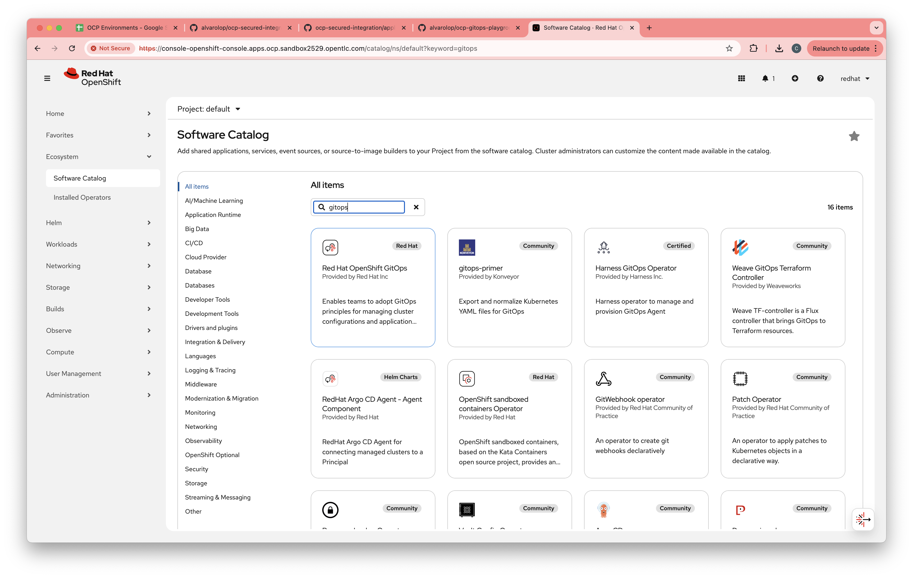
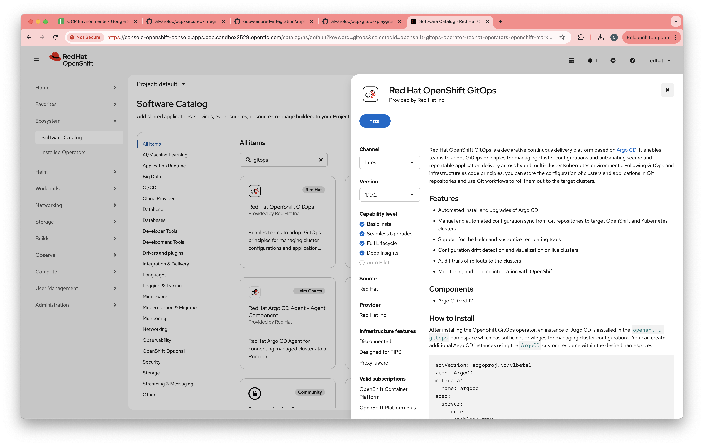
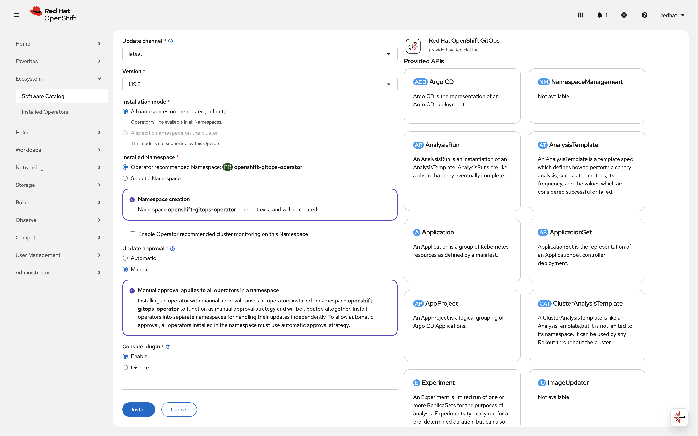

# Red Hat OpenShift AI 3.3 — Installation Manual

**Version:** 3.3 Self-Managed  
**Target Platform:** OpenShift Container Platform 4.20  
**Date:** March 2026  
**Classification:** Internal / Operations

---

## Table of Contents

1. [Overview](#1-overview)
2. [Using This Guide with Claude Code or OpenCode](#using-this-guide-with-claude-code-or-opencode)
3. [Global Prerequisites](#2-global-prerequisites)
4. [Prerequisite Operators](#3-prerequisite-operators)
5. [Installing the Red Hat OpenShift AI Operator](#4-installing-the-red-hat-openshift-ai-operator)
6. [Configuring the DataScienceCluster](#5-configuring-the-datasciencecluster)
7. [TLS Certificate Management](#6-tls-certificate-management)
8. [OpenTelemetry Observability for RHOAI](#7-opentelemetry-observability-for-rhoai)
9. [Distributed Inference with llm-d](#8-distributed-inference-with-llm-d)
10. [Model as a Service (MaaS)](#9-model-as-a-service-maas)
11. [Validation and Testing](#10-validation-and-testing)
12. [Appendix A — Quick-Reference Commands](#appendix-a--quick-reference-commands)
13. [Appendix B — Troubleshooting](#appendix-b--troubleshooting)
14. [Appendix C — Reference Links](#appendix-c--reference-links)

---

## 1. Overview

Red Hat OpenShift AI (RHOAI) 3.3 is a self-managed AI/ML platform that provides an integrated environment for developing, training, serving, and monitoring models across hybrid cloud environments. This manual covers a full installation plan organized into two tiers.

**RHOAI Basic Features:**

* Dashboard
* Data Science Pipelines
* Model Serving (KServe single-model serving)
* Model Registry
* Workbenches
* TrustyAI (model monitoring and bias detection)

> **Note:** Multi-Model Serving via ModelMesh is **not supported** in RHOAI 3.x. KServe is the only supported model-serving platform from RHOAI 3.0 onwards.

**Additional Features:**

* Distributed Inference with llm-d — GA in RHOAI 3.3 (disaggregated prefill/decode, Inference Gateway, KV-cache-aware routing). **Requires OCP 4.20 or later.**
* Model as a Service — MaaS (governed, rate-limited LLM access via Gateway API and Connectivity Link)
* Llama Stack Operator (OpenAI-compatible RAG APIs and agentic AI) — *documentation in progress*

**Cross-Cutting Concerns:**

* OpenTelemetry observability (traces, metrics, and logs for RHOAI and model serving components)
* TLS certificate management (via cert-manager Operator or manual certificate generation)

> **Important:** There is no upgrade path from OpenShift AI 2.x to 3.3. This version requires a fresh installation. For distributed inference with llm-d, OCP 4.20 is required.

**Official Documentation:**

* [RHOAI 3.3 Product Documentation](https://docs.redhat.com/en/documentation/red_hat_openshift_ai_self-managed/3.3)
* [Supported Configurations for 3.x](https://access.redhat.com/articles/rhoai-supported-configs-3.x)
* [Supported Product and Hardware Configurations](https://docs.redhat.com/en/documentation/red_hat_ai/3/html/supported_product_and_hardware_configurations/index)
* [llm-d Release Component Versions](https://access.redhat.com/articles/7136620)

---

## Using This Guide with Claude Code or OpenCode

This repository includes an [`AGENTS.md`](AGENTS.md) file that gives Claude Code (and compatible tools such as OpenCode) full context about the installation phases, required environment variables, wait conditions, and known gotchas — so an AI assistant can co-pilot the deployment rather than just answer questions about it.

### What the AI assistant can do for you

* Run preflight checks and report failures before you touch anything.
* Fill in `helm template` and `oc apply` commands with your actual environment variables.
* Watch pod and operator status and tell you when it is safe to move to the next phase.
* Diagnose errors by reading command output you paste into the chat.
* Stop and ask for confirmation before any destructive or cluster-wide action (InstallPlan approvals, RBAC changes).

### How to start a session

1. Open this repository in Claude Code or OpenCode — the tool will read `AGENTS.md` automatically.
2. Make sure you are logged in to the cluster (`oc whoami`).
3. Tell the assistant which phase you are on and provide any environment variables it asks for:

   > *"I'm on Phase 0. My AWS region is `eu-west-1`. Let's start the preflight checks."*

4. After each phase the assistant will report a **human gate** — a set of conditions you need to confirm before it proceeds.

### Phase overview

| Phase | What happens | Approx. time |
| --- | --- | --- |
| 0 | Cluster validation (OCP version, admin access, StorageClass, no conflicting operators) | 5 min |
| 1 | ArgoCD + cert-manager + Let's Encrypt certificates for Ingress and API | 15–20 min |
| 2 | GPU nodes (AWS MachineSets), Node Feature Discovery, NVIDIA GPU Operator | 20–40 min |
| 3 | Connectivity Link, Leader Worker Set, RHOAI operator, DataScienceCluster | 20–30 min |
| 4 | Monitoring stack — Tempo, OpenTelemetry, Grafana | 10 min |
| 5 | llm-d Quick Start — Gateway, namespace, LLMInferenceService, curl smoke test | 15–20 min |

### Resuming after an error

Paste the failing command and its output into the chat and say which phase you were on. The assistant will diagnose the problem and suggest the next step without restarting from scratch.

---

## 2. Global Prerequisites

### 2.1 Cluster Requirements

| Requirement | Specification |
| --- | --- |
| OpenShift Container Platform | **4.20** (required for llm-d) |
| Worker nodes (base) | Minimum 2 nodes, 8 vCPU / 32 GiB RAM each |
| Single-node OpenShift | 32 vCPU / 128 GiB RAM |
| GPU nodes (model serving, llm-d) | NVIDIA A100 / H100 / H200 / A10G / L40S or AMD MI250+ |
| Architecture | x86\_64 (primary); aarch64, ppc64le, s390x also supported |
| Cluster admin access | Required for operator installation |
| OpenShift CLI (`oc`) | Installed and authenticated |
| Open Data Hub | Must **not** be installed on the cluster |

### 2.2 Storage Requirements

A default StorageClass with dynamic provisioning must be configured. Verify with:

```bash
oc get storageclass | grep '(default)'
```

S3-compatible object storage is needed for Pipelines, Model Registry, and model artifact storage (OpenShift Data Foundation, MinIO, or AWS S3).

### 2.3 Network Requirements

* Outbound access to `registry.redhat.io` and `quay.io` (or a disconnected mirror).
* For llm-d with RoCE: RDMA-capable NICs (see [Section 8.3](#83-roce-networking-optional-but-recommended-for-production)).
* DNS must be properly configured. In private cloud environments, manually configure DNS A/CNAME records after LoadBalancer IPs become available.

### 2.4 Credentials

* Hugging Face token (`HF_TOKEN`) for downloading gated model weights used with llm-d and MaaS.
* Red Hat pull secret (from [console.redhat.com](https://console.redhat.com)).

---

## 3. Prerequisite Operators

RHOAI 3.3 requires several operators installed **before** creating the DataScienceCluster. Install them via **Operators → OperatorHub** in the web console or via CLI Subscription objects.

> **Note on cert-manager:** The cert-manager Operator for Red Hat OpenShift is recommended for automating TLS certificate lifecycle across RHOAI, llm-d, OpenTelemetry, and Llama Stack. It is not a hard requirement — you can provide manually generated certificates wherever TLS is needed. That said, several components document cert-manager as a dependency in their official guides, making it the path of least resistance for most deployments.

> **Note on Service Mesh:** Do **not** install OpenShift Service Mesh 2.x under any circumstances. It is not supported in RHOAI 3.x and its CRDs conflict with the llm-d gateway component. Service Mesh 3.x is only required if you plan to deploy the **Llama Stack Operator** — it is **not** needed for base RHOAI or llm-d.

### 3.0 ArgoCD (Red Hat OpenShift GitOps)

Go to `Ecosystem / Software Catalog`, search for **gitops**, then click **Red Hat OpenShift GitOps**.

[](images/gitops-install-1.png)

Leave the defaults and click **Install**.

[](images/gitops-install-2.png)

Leave the defaults as shown and click **Install**.

[](images/gitops-install-3.png)

### 3.1 Cert-Manager Operator and Let's Encrypt Certificate Issuer

#### RBAC Permissions for cert-manager and supporting components

Grant cert-manager the permissions it needs for Certificates, CertificateRequests, Orders, Challenges, ClusterIssuers, Issuers, and optional monitoring integration:

```bash
oc apply -f - <<EOF
apiVersion: rbac.authorization.k8s.io/v1
kind: ClusterRole
metadata:
  name: credentialsrequest-manager
rules:
- apiGroups:
  - cloudcredential.openshift.io
  resources:
  - credentialsrequests
  verbs:
  - get
  - list
  - watch
  - create
  - update
  - patch
  - delete
- apiGroups:
  - monitoring.coreos.com
  resources:
  - servicemonitors
  verbs:
  - get
  - list
  - watch
  - create
  - update
  - patch
  - delete
- apiGroups:
  - cert-manager.io
  resources:
  - clusterissuers
  - issuers
  - certificates
  - certificaterequests
  - orders
  - challenges
  verbs:
  - get
  - list
  - watch
  - create
  - update
  - patch
  - delete
---
apiVersion: rbac.authorization.k8s.io/v1
kind: ClusterRoleBinding
metadata:
  name: argocd-credentialsrequest-manager
roleRef:
  apiGroup: rbac.authorization.k8s.io
  kind: ClusterRole
  name: credentialsrequest-manager
subjects:
- kind: ServiceAccount
  name: openshift-gitops-argocd-application-controller
  namespace: openshift-gitops
EOF
```

#### Installing the operator

```bash
cat <<EOF | oc apply -f -
apiVersion: argoproj.io/v1alpha1
kind: Application
metadata:
  labels:
    app: cert-manager-operator
  name: cert-manager-operator
  namespace: openshift-gitops
spec:
  destination:
    server: 'https://kubernetes.default.svc'
  project: default
  source:
    path: gitops/operators/cert-manager-operator
    repoURL: https://github.com/alpha-hack-program/llm-d-guide.git
    targetRevision: main
  syncPolicy:
    automated:
      prune: false
      selfHeal: false
EOF
```

#### Installing Let's Encrypt Cluster Issuers and certificates for OpenShift Ingress and API Server

```bash
# 0) Check if logged in with oc
if ! oc whoami &>/dev/null; then
  echo "Error: Not logged in to OpenShift. Please run 'oc login ...' before proceeding."
  exit 1
fi

# 1) Wait for the operator to be ready ==> TODO REVIEW
echo -n "Waiting for cert-manager pods to be ready..."
while [[ $(oc get pods -l app.kubernetes.io/instance=cert-manager -n cert-manager \
  -o 'jsonpath={..status.conditions[?(@.type=="Ready")].status}') != "True True True" ]]; do
  echo -n "." && sleep 1
done
echo -e "  [OK]"

# 2) Detect cluster domain and AWS region
CLUSTER_DOMAIN=$(oc get dns.config/cluster -o jsonpath='{.spec.baseDomain}')
AWS_DEFAULT_REGION="${AWS_DEFAULT_REGION:=eu-west-1}"

[[ -z "${CLUSTER_DOMAIN}" ]] && { echo "Error: CLUSTER_DOMAIN could not be detected."; exit 1; }
[[ -z "${AWS_DEFAULT_REGION}" ]] && { echo "Error: AWS_DEFAULT_REGION is not set."; exit 1; }

echo "CLUSTER_DOMAIN=${CLUSTER_DOMAIN}"
echo "AWS_DEFAULT_REGION=${AWS_DEFAULT_REGION}"
```

Install the certificate issuers:

```bash
cat <<EOF | oc apply -f -
apiVersion: argoproj.io/v1alpha1
kind: Application
metadata:
  labels:
    app: cert-manager-route53
  name: cert-manager-route53
  namespace: openshift-gitops
spec:
  destination:
    server: 'https://kubernetes.default.svc'
  project: default
  source:
    path: gitops/operators/cert-manager-route53
    repoURL: https://github.com/alpha-hack-program/llm-d-guide.git
    targetRevision: main
    helm:
      parameters:
        - name: clusterDomain
          value: ${CLUSTER_DOMAIN}
        - name: route53.region
          value: ${AWS_DEFAULT_REGION}
  syncPolicy:
    automated:
      prune: false
      selfHeal: false
EOF
```

Verify certificate status:

```bash
oc get certificates.cert-manager.io --all-namespaces \
  -o custom-columns='NAMESPACE:.metadata.namespace,NAME:.metadata.name,STATUS:.status.conditions[0].type,READY:.status.conditions[0].status'
```

### 3.2 GPU and Hardware Dependencies

| Operator | Channel | Purpose |
| --- | --- | --- |
| Node Feature Discovery (NFD) Operator | `stable` | Detects GPU hardware capabilities |
| NVIDIA GPU Operator | `stable` (latest) | GPU device plugin, drivers, DCGM |

Install NFD first, then the NVIDIA GPU Operator, via `Ecosystem / Software Catalog`.

> **Note:** The NVIDIA GPU Operator channel changes with each release. Always select the latest `stable` channel from OperatorHub rather than pinning to a specific version.

Create the required NodeFeatureDiscovery custom resource:

**EXAMPLE, don't create manually, keep reading:**

```yaml
apiVersion: nfd.openshift.io/v1
kind: NodeFeatureDiscovery
metadata:
  name: nfd-instance
  namespace: openshift-nfd
spec:
  operand:
    image: registry.redhat.io/openshift4/ose-node-feature-discovery-rhel9
    imagePullPolicy: Always
  workerConfig:
    configData: |
      core:
        sleepInterval: 60s
      sources:
        pci:
          deviceClassWhitelist:
            - "0200"
            - "03"
            - "12"
          deviceLabelFields:
            - vendor
```

Create the ClusterPolicy custom resource:

**EXAMPLE, don't create manually, keep reading:**

```yaml
apiVersion: nvidia.com/v1
kind: ClusterPolicy
metadata:
  name: gpu-cluster-policy
spec:
  operator:
    defaultRuntime: crio
  driver:
    enabled: true
  toolkit:
    enabled: true
  devicePlugin:
    enabled: true
  dcgm:
    enabled: true
  dcgmExporter:
    enabled: true
  validator:
    enabled: true
  mig:
    strategy: single  # or 'mixed' if using MIG partitioning
```

Apply using kustomize:

```bash
oc apply -k gitops/instance/nfd
oc apply -k gitops/instance/nvidia
```

See: [NVIDIA GPU Operator on Red Hat OpenShift Container Platform](https://docs.nvidia.com/datacenter/cloud-native/openshift/latest/index.html)

TODO Add some tests to verify that NVIDIA related labels are added to the GPU nodes.

#### Adding A10G GPU nodes in AWS with MachineSets

```bash
export INFRA_ID=$(oc get infrastructure cluster -o jsonpath='{.status.infrastructureName}')
export AWS_REGION="${AWS_REGION:=eu-west-1}"
export AMI_ID="${AMI_ID:=ami-0b8c325b7499597c6}"
export AWS_INSTANCE_TYPE="${AWS_INSTANCE_TYPE:=g5.2xlarge}"
export AWS_INSTANCES_PER_AZ=${AWS_INSTANCES_PER_AZ:=1}

echo "INFRA_ID=${INFRA_ID}, AWS_REGION=${AWS_REGION}, AMI_ID=${AMI_ID}, AWS_INSTANCE_TYPE=${AWS_INSTANCE_TYPE}"

for AZ in a b c; do
  helm template gpu-worker ./gitops/instance/machine-sets/gpu-worker \
    --set infrastructureId="${INFRA_ID}" \
    --set region=${AWS_REGION} \
    --set instanceType=${AWS_INSTANCE_TYPE} \
    --set amiId="${AMI_ID}" \
    --set devicePluginConfig="" \
    --set az=${AZ} | oc apply -f -
done
```

### 3.3 Core Dependencies (All Installations)

| Operator | Channel | Purpose | Required For |
| --- | --- | --- | --- |
| Red Hat — Authorino Operator | `managed-services` | Token auth for single-model serving endpoints | KServe / llm-d |
| cert-manager Operator for Red Hat OpenShift | `stable-v1` | Automated TLS certificate lifecycle | Recommended (see above) |
| Red Hat Build of Kueue | `stable` | Distributed workload quota and scheduling | GPUaaS / Distributed Workloads only (**not** required for llm-d) |
| Red Hat OpenShift Leader Worker Set Operator | `stable` | Multi-node leader/worker pod sets | llm-d (required) |

> **Note on Serverless:** The Red Hat OpenShift Serverless operator (Knative Serving) is **not required** for RHOAI 3.x. It was a prerequisite for the legacy KServe serverless mode in RHOAI 2.x, but RHOAI 3.x uses KServe in raw deployment mode by default and does not require Serverless.

> **Note on Service Mesh 3.x:** Install OpenShift Service Mesh 3.x **only** if you intend to use the Llama Stack Operator. It is not a prerequisite for llm-d or base RHOAI model serving.

```bash
# 1. Connectivity Link (Authorino + Limitador — required for RHOAI 3.x KServe auth and MaaS)
oc apply -k ./gitops/operators/connectivity-link
# InstallPlan may require manual approval due to dependencies
oc get installplan -n openshift-operators | grep -i "requiresapproval"
# If an InstallPlan is pending, approve it:
# oc patch installplan <NAME> -n openshift-operators --type merge -p '{"spec":{"approved":true}}'
oc get csv -n openshift-operators -w | grep -E "rhcl|authorino|limitador"
# Wait for AuthPolicy CRD
oc wait --for=condition=Established crd/authpolicies.kuadrant.io --timeout=300s

# 2. Leader Worker Set (required for llm-d multi-node deployments)
# Apply in a loop to work around potential CRD install race conditions
until oc apply -k ./gitops/operators/leader-worker-set; do
  echo "Waiting for LeaderWorkerSet CRD to become available..."
  sleep 10
done
oc wait --for=condition=Established crd/leaderworkersetoperators.operator.openshift.io --timeout=300s
oc get csv -n openshift-lws-operator -w | grep -E "leader-worker-set"

# 3. Red Hat OpenShift AI Operator
oc apply -k gitops/operators/rhoai
oc get csv -n redhat-ods-operator -w | grep -E "rhods"

# 4. Configure OpenShift AI (DSCInitialization and DataScienceCluster)
oc wait --for=condition=Established crd/dashboards.components.platform.opendatahub.io --timeout=600s
# Render and apply (chart emits resources across multiple namespaces)
helm template rhoai ./gitops/instance/rhoai | oc apply -f -

# Wait for LLMInferenceService CRD and controller pods
oc wait --for=condition=Established crd/llminferenceservices.serving.kserve.io --timeout=300s
oc wait --for=condition=ready pod -l control-plane=odh-model-controller \
  -n redhat-ods-applications --timeout=300s
oc wait --for=condition=ready pod -l control-plane=kserve-controller-manager \
  -n redhat-ods-applications --timeout=300s

# 5. Monitoring stack
# a) Tempo Operator (distributed tracing)
oc apply -k gitops/operators/tempo-operator
oc get csv -n openshift-operators -w | grep -E "tempo"

# b) OpenTelemetry Operator
oc apply -k gitops/operators/opentelemetry-operator
oc get csv -n openshift-operators -w | grep -E "opentelemetry"
oc wait --for=condition=Established crd/instrumentations.opentelemetry.io --timeout=120s

# c) Grafana Operator (optional — for custom dashboards)
oc apply -k gitops/operators/grafana-operator
oc get csv -n grafana-operator -w | grep -E "grafana"
oc wait --for=jsonpath='{.status.phase}'=Succeeded csv -n grafana-operator \
  -l operators.coreos.com/grafana-operator.grafana-operator= --timeout=300s
```

#### Optional — Red Hat Build of Kueue (GPUaaS / Distributed Workloads only)

> ⚠️ **Do NOT install** unless you specifically need GPUaaS or distributed workload queue management
> (Ray, PyTorch distributed training). Installing Kueue causes the RHOAI dashboard to label all
> new projects with `kueue.openshift.io/managed=true`. Projects with this label only see hardware
> profiles with `scheduling.type: Queue` — standard `Node`-type profiles become invisible unless
> matching `Queue`-type profiles and LocalQueues are also configured.
>
> **Known issue (RHOAI 3.3.0):** The dashboard does not reload its configuration when `disableKueue`
> is toggled in `OdhDashboardConfig`. Restart the dashboard after any change:
> `oc rollout restart deployment/rhods-dashboard -n redhat-ods-applications`

```bash
# OPTIONAL — only for GPUaaS / distributed workloads
oc apply -k gitops/operators/kueue-operator
oc get csv -n openshift-operators -w | grep -E "kueue"
```

```bash
# OPTIONAL — wait for Kueue CRDs before configuring ClusterQueue
oc wait --for=condition=Established crd/clusterqueues.kueue.x-k8s.io --timeout=600s
oc wait --for=condition=Established crd/resourceflavors.kueue.x-k8s.io --timeout=600s
oc wait --for=condition=Established crd/localqueues.kueue.x-k8s.io --timeout=600s
```

```bash
# OPTIONAL — set Kueue to Managed in the DataScienceCluster after operator is ready
oc patch datasciencecluster default-dsc \
  --type='merge' \
  -p '{"spec":{"components":{"kueue":{"managementState":"Managed","defaultClusterQueueName":"default","defaultLocalQueueName":"default"}}}}'
```

```bash
# OPTIONAL — minimal ClusterQueue + ResourceFlavor setup
cat <<EOF | oc apply -f -
apiVersion: kueue.x-k8s.io/v1beta1
kind: ResourceFlavor
metadata:
  name: default-flavor
---
apiVersion: kueue.x-k8s.io/v1beta1
kind: ClusterQueue
metadata:
  name: default
spec:
  namespaceSelector: {}
  resourceGroups:
  - coveredResources: ["cpu", "memory", "nvidia.com/gpu"]
    flavors:
    - name: default-flavor
      resources:
      - name: cpu
        nominalQuota: "64"
      - name: memory
        nominalQuota: "256Gi"
      - name: nvidia.com/gpu
        nominalQuota: "8"
EOF
```

```bash
# OPTIONAL — create a LocalQueue in each Kueue-managed namespace
cat <<EOF | oc apply -f -
apiVersion: kueue.x-k8s.io/v1beta1
kind: LocalQueue
metadata:
  name: default
  namespace: <your-namespace>
spec:
  clusterQueue: default
EOF
```

```bash
# OPTIONAL — Queue-type hardware profile for Kueue-managed namespaces
# (Node-type profiles are invisible in namespaces with kueue.openshift.io/managed=true)
cat <<EOF | oc apply -f -
apiVersion: infrastructure.opendatahub.io/v1
kind: HardwareProfile
metadata:
  name: default-cpu-queue
  namespace: redhat-ods-applications
  annotations:
    opendatahub.io/display-name: "Default CPU (Kueue)"
    opendatahub.io/disabled: "false"
spec:
  identifiers:
  - displayName: CPU
    identifier: cpu
    minCount: 1
    maxCount: 4
    defaultCount: 2
    resourceType: CPU
  - displayName: Memory
    identifier: memory
    minCount: 2Gi
    maxCount: 8Gi
    defaultCount: 4Gi
    resourceType: Memory
  scheduling:
    type: Queue
    queue:
      localQueueName: default
EOF
```

### 3.4 Pipeline Dependencies

| Operator | Channel | Purpose |
| --- | --- | --- |
| Red Hat OpenShift Pipelines | `latest` | Tekton pipelines for data science workflows |

> **Note:** The OpenShift Pipelines operator is optional for llm-d. It is required only if you plan to use Data Science Pipelines features in RHOAI.

```bash
oc apply -k gitops/operators/pipelines

# If the InstallPlan requires manual approval (YOU MAY NEED TO WAIT FOR SOME MINS TO SEE THE INSTALLPLAN!!):
INSTALLPLAN_NAME=$(oc get installplan -n openshift-operators -o json | \
  jq -r '.items[] | select(.spec.clusterServiceVersionNames[]? | contains("openshift-pipelines-operator-rh")) | .metadata.name')
oc patch installplan "$INSTALLPLAN_NAME" -n openshift-operators \
  --type merge --patch '{"spec":{"approved":true}}'

oc get csv -n openshift-operators -w | grep -E "pipelines"
```

### 3.5 Check Operators

```bash
./scripts/check-operators.sh
```

---

# Quick Start Guide to Deploy llm-d

Deploy llm-d on a connected OpenShift 4.20 cluster with RHOAI 3.3.

> **Prerequisites:** Complete all steps in Section 3 before proceeding. In particular, confirm that the `LLMInferenceService` CRD is available (`oc get crd llminferenceservices.serving.kserve.io`) and that both `odh-model-controller` and `kserve-controller-manager` pods are Running in `redhat-ods-applications`.

## Step 1: Configure the Gateway

Create the GatewayClass and Gateway for llm-d.

**Using a LoadBalancer with a pre-existing certificate:**

```bash
APP_NAME=gateway
GATEWAY_NAME=${GATEWAY_NAME:=openshift-ai-inference}
CLUSTER_DOMAIN=$(oc get ingresses.config.openshift.io cluster -o jsonpath='{.spec.domain}')
echo "CLUSTER_DOMAIN=${CLUSTER_DOMAIN}"

helm template gitops/instance/llm-d/gateway \
  --name-template ${APP_NAME} \
  --set gatewayName="${GATEWAY_NAME}" \
  --set clusterDomain="${CLUSTER_DOMAIN}" \
  --set subdomain=inference \
  --set useOpenShiftRoute=false \
  --set tls.secretName=ingress-certs \
  --include-crds | oc apply -f -
```

**Using OpenShift router and generating a self-signed certificate**

```bash
APP_NAME=gateway
GATEWAY_NAME=${GATEWAY_NAME:=openshift-ai-inference}
CLUSTER_DOMAIN=$(oc get ingresses.config.openshift.io cluster -o jsonpath='{.spec.domain}')
echo "CLUSTER_DOMAIN=${CLUSTER_DOMAIN}"

helm template gitops/instance/llm-d/gateway \
  --name-template ${APP_NAME} \
  --set gatewayName="${GATEWAY_NAME}" \
  --set clusterDomain="${CLUSTER_DOMAIN}" \
  --set subdomain=inference \
  --set useOpenShiftRoute=true \
  --set tls.secretName="${GATEWAY_NAME}" \
  --set tls.generate=true --include-crds | oc apply -f -
```

> **Other gateway configurations:** See `gitops/instance/llm-d/gateway/README.md` for alternative setups (bare metal, self-signed certs, OpenShift Routes).

Verify the Gateway is ready:

```bash
oc get gateway -n openshift-ingress

# Expected output:
# NAME                              CLASS                            PROGRAMMED   AGE
# openshift-ai-inference            openshift-ai-inference-class     True         ...
```

## Step 2: Create Namespace

```bash
PROJECT="llm-d-demo"

oc new-project ${PROJECT}
oc label namespace ${PROJECT} modelmesh-enabled=false opendatahub.io/dashboard=true
```

## Step 3: Deploy an LLMInferenceService

### Option A — Qwen3-8B-FP8 via OCI ModelCar (recommended for air-gapped / registry-cached deployments)

Create a values override file:

```bash
cat <<EOF > qwen3-8b-fp8-dynamic-oci.tmp.yaml
deploymentType: intelligent-inference
serviceName: qwen3-8b
replicas: 2
useStartupProbe: true
storage:
  type: oci
  uri: oci://registry.redhat.io/rhelai1/modelcar-qwen3-8b-fp8-dynamic:1.5
model:
  name: alibaba/qwen3-8b
resources:
  limits: { cpu: "4", memory: 16Gi, gpuCount: "1" }
  requests: { cpu: "1", memory: 8Gi, gpuCount: "1" }
env:
  - name: VLLM_ADDITIONAL_ARGS
    value: "--disable-uvicorn-access-log --enable-auto-tool-choice --tool-call-parser hermes"
EOF
```

Render and apply:

```bash
helm template gitops/instance/llm-d/inference \
  --name-template qwen3-8b -n ${PROJECT} \
  -f gitops/instance/llm-d/inference/values.yaml \
  -f qwen3-8b-fp8-dynamic-oci.tmp.yaml \
  --include-crds | oc apply -f -
```

### Option B — Facebook OPT-125m via HuggingFace (quick test with a small public model)

```bash
cat <<EOF > facebook-opt-125m-hf.tmp.yaml
deploymentType: intelligent-inference
serviceName: opt-125m
replicas: 1
useStartupProbe: true
storage:
  type: hf
  uri: hf://facebook/opt-125m
model:
  name: facebook/opt-125m
resources:
  limits: { cpu: "2", memory: 8Gi, gpuCount: 1 }
  requests: { cpu: "1", memory: 4Gi, gpuCount: 1 }
EOF

helm template gitops/instance/llm-d/inference \
  --name-template opt-125m -n ${PROJECT} \
  -f gitops/instance/llm-d/inference/values.yaml \
  -f facebook-opt-125m-hf.tmp.yaml \
  --include-crds | oc apply -f -
```

> **HuggingFace access:** If using a gated model, ensure your `HF_TOKEN` secret is configured in the namespace before deploying.

## Step 4: Verify Deployment

### Check LLMInferenceService status

```bash
oc get llminferenceservice -w -n ${PROJECT}

# Expected output:
# NAME       URL                                                    READY   AGE
# qwen3-8b   https://<gateway-url>/${PROJECT}/qwen3-8b             True    5m
```

### Check pods

```bash
oc get pods -w -n ${PROJECT}

# Expected output:
# NAME                                            READY   STATUS    AGE
# qwen3-8b-kserve-xxxxx-xxxxx                    1/1     Running   3m
# qwen3-8b-kserve-xxxxx-xxxxx                    1/1     Running   3m
# qwen3-8b-kserve-router-scheduler-xxxxx         1/1     Running   3m
```

### Watch pod logs

```bash
# vLLM server logs
oc logs -f \
  -l app.kubernetes.io/name=qwen3-8b,app.kubernetes.io/component=llminferenceservice-workload \
  -n ${PROJECT}

# Scheduler logs
oc logs -f \
  -l app.kubernetes.io/name=qwen3-8b,app.kubernetes.io/component=llminferenceservice-router-scheduler \
  -n ${PROJECT}
```

## Step 5: Test the Endpoint

### Get the inference URL

```bash
INFERENCE_URL=$(oc get gateway openshift-ai-inference -n openshift-ingress \
  -o json | jq -r '.spec.listeners[] | select(.name=="https").hostname')
echo "Inference URL: https://${INFERENCE_URL}"
```

### List available models

```bash
curl -s https://${INFERENCE_URL}/${PROJECT}/qwen3-8b/v1/models | jq
```

### Send a completion request

```bash
curl -s -X POST https://${INFERENCE_URL}/${PROJECT}/qwen3-8b/v1/completions \
  -H "Content-Type: application/json" \
  -d '{
    "model": "alibaba/qwen3-8b",
    "prompt": "Explain the difference between supervised and unsupervised learning.",
    "max_tokens": 50,
    "temperature": 0.7
  }' | jq '.choices[0].text'
```

### Send a chat completion request

```bash
curl -s -X POST https://${INFERENCE_URL}/${PROJECT}/qwen3-8b/v1/chat/completions \
  -H "Content-Type: application/json" \
  -d '{
    "model": "alibaba/qwen3-8b",
    "messages": [
      {"role": "system", "content": "You are a helpful assistant. Be VERY concise"},
      {"role": "user", "content": "Answer to the Ultimate Question of Life, the Universe, and Everything."}
    ],
    "max_tokens": 200,
    "temperature": 0.7
  }' | jq '.choices[0].message.content'
```

## Step 6: Deploy Monitoring (Optional)

Deploy Prometheus and Grafana for performance monitoring (TTFT, inter-token latency, KV cache hit rates, GPU utilization):

```bash
until oc apply -k gitops/instance/llm-d-monitoring; do : ; done

# Get Grafana URL
oc get route grafana -n llm-d-monitoring -o jsonpath='{.spec.host}'
```

Access Grafana with default credentials: `admin` / `admin`

---

## Quick Start Summary

| Step | Command | Verification |
| --- | --- | --- |
| 1. Configure Gateway | `CLUSTER_DOMAIN=$(oc get ingresses.config.openshift.io cluster -o jsonpath='{.spec.domain}'); helm template gitops/instance/llm-d/gateway --name-template gateway --set clusterDomain="${CLUSTER_DOMAIN}" --include-crds \| oc apply -f -` | `oc get gateway -n openshift-ingress` |
| 2. Create namespace | `PROJECT=llm-d-demo; oc new-project ${PROJECT}; oc label namespace ${PROJECT} modelmesh-enabled=false opendatahub.io/dashboard=true` | `oc get ns ${PROJECT}` |
| 3. Deploy model | Create override file (see Step 3), then: `helm template gitops/instance/llm-d/inference --name-template qwen3-8b -n ${PROJECT} -f gitops/instance/llm-d/inference/values.yaml -f qwen3-8b-fp8-dynamic-oci.tmp.yaml --include-crds \| oc apply -f -` | `oc get llminferenceservice -n ${PROJECT}` |
| 4. Test endpoint | `INFERENCE_URL=$(oc get gateway openshift-ai-inference -n openshift-ingress -o json \| jq -r '.spec.listeners[] \| select(.name=="https").hostname'); curl -s https://${INFERENCE_URL}/${PROJECT}/qwen3-8b/v1/models \| jq` | JSON response |

---

## Cleanup

Resources were applied with `helm template ... | oc apply -f -` (no Helm release state), so remove them by piping the same template to `oc delete -f -`:

```bash
# Remove inference deployment
helm template gitops/instance/llm-d/inference \
  --name-template qwen3-8b -n ${PROJECT} \
  -f gitops/instance/llm-d/inference/values.yaml \
  -f qwen3-8b-fp8-dynamic-oci.tmp.yaml \
  --include-crds | oc delete -f -

# Remove gateway
CLUSTER_DOMAIN=$(oc get ingresses.config.openshift.io cluster -o jsonpath='{.spec.domain}')
helm template gitops/instance/llm-d/gateway \
  --name-template gateway \
  --set clusterDomain="${CLUSTER_DOMAIN}" \
  --include-crds | oc delete -f -

# Delete namespace
oc delete ns ${PROJECT}
```

To remove only the LLMInferenceService and leave the gateway in place:

```bash
oc delete llminferenceservice qwen3-8b -n ${PROJECT}
```

---

## Appendix A — Quick-Reference Commands

```bash
# Check all operator CSVs
oc get csv -A | grep -v Succeeded

# Watch RHOAI pods
oc get pods -n redhat-ods-applications -w

# Check llm-d CRD availability
oc get crd | grep llminference

# Describe a failing LLMInferenceService
oc describe llminferenceservice <name> -n <namespace>

# Check gateway status
oc get gateway,httproute -n openshift-ingress

# Stream scheduler logs
oc logs -f -l app.kubernetes.io/component=llminferenceservice-router-scheduler -n <namespace>
```

---

## Appendix B — Troubleshooting

| Symptom | Likely Cause | Resolution |
| --- | --- | --- |
| `LLMInferenceService` stuck in `Not Ready` | Controller pods not running | Check `odh-model-controller` and `kserve-controller-manager` pods in `redhat-ods-applications` |
| Gateway not `PROGRAMMED` | Connectivity Link CRDs missing or Authorino not running | Verify `oc get authpolicies.kuadrant.io` and Authorino pod status |
| `resource mapping not found` during helm apply | CRDs not yet established | Re-run `oc wait --for=condition=Established crd/...` before applying |
| InstallPlan stuck pending | Manual approval required | `oc patch installplan <NAME> -n openshift-operators --type merge -p '{"spec":{"approved":true}}'` |
| GPU nodes not scheduling | NFD labels missing | Check `oc get nodes -l feature.node.kubernetes.io/pci-10de.present=true` |
| cert-manager webhook errors | cert-manager pods not ready | Wait for all 3 cert-manager pods (controller, cainjector, webhook) to be Ready |
| No hardware profiles in RHOAI dashboard | `kueue.openshift.io/managed=true` on namespace but Kueue not installed or no `Queue`-type profiles exist | Either remove the label (`oc label namespace <ns> kueue.openshift.io/managed-`) or create `Queue`-type hardware profiles with a matching LocalQueue |
| Hardware profiles missing after toggling `disableKueue` | Dashboard does not reload config automatically | Restart the dashboard: `oc rollout restart deployment/rhods-dashboard -n redhat-ods-applications` |
| model-catalog API returns 500 errors | PostgreSQL schema empty (migrations did not apply) | Restart model-catalog: `oc rollout restart deployment/model-catalog -n rhoai-model-registries` |

---

## Appendix C — Reference Links

| Resource | URL |
| --- | --- |
| RHOAI 3.3 Documentation | https://docs.redhat.com/en/documentation/red_hat_openshift_ai_self-managed/3.3 |
| Supported Configurations 3.x | https://access.redhat.com/articles/rhoai-supported-configs-3.x |
| Supported Hardware Configurations | https://docs.redhat.com/en/documentation/red_hat_ai/3/html/supported_product_and_hardware_configurations/index |
| llm-d Release Component Versions | https://access.redhat.com/articles/7136620 |
| NVIDIA GPU Operator on OCP | https://docs.nvidia.com/datacenter/cloud-native/openshift/latest/index.html |
| cert-manager on OpenShift | https://docs.openshift.com/container-platform/4.20/security/cert_manager_operator/index.html |
| ocp-secured-integration (cert-manager GitOps) | https://github.com/alvarolop/ocp-secured-integration |
| RHOAI GitOps reference | https://github.com/alvarolop/rhoai-gitops |
| llm-d upstream project | https://github.com/llm-d/llm-d |