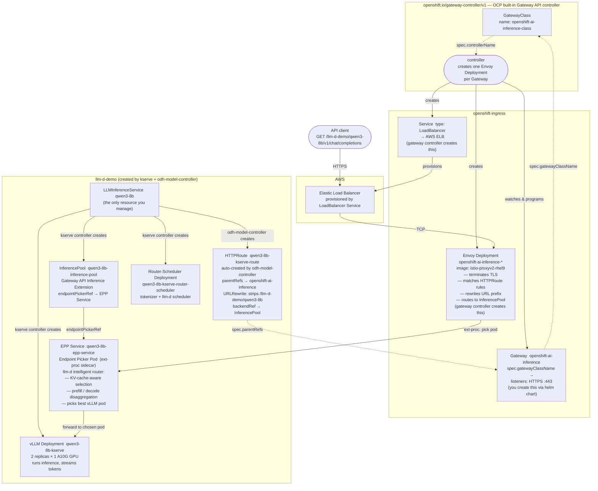
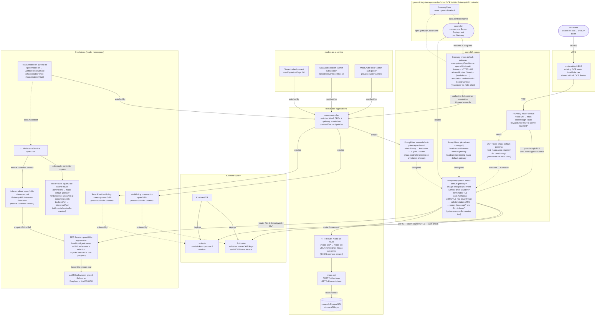

# Red Hat OpenShift AI 3.4 — Installation Manual

**Version:** 3.4 Self-Managed  
**Target Platform:** OpenShift Container Platform 4.19+ (llm-d requires 4.20+; tested on 4.21)  
**Date:** May 2026  
**Classification:** Internal / Operations

---

## Table of Contents

1. [Overview](#1-overview)
2. [Global Prerequisites](#2-global-prerequisites)
3. [Prerequisite Operators](#3-prerequisite-operators)
4. [Installing the Red Hat OpenShift AI Operator](#4-installing-the-red-hat-openshift-ai-operator)
5. [Configuring the DataScienceCluster](#5-configuring-the-datasciencecluster)
6. [TLS Certificate Management](#6-tls-certificate-management)
7. [OpenTelemetry Observability for RHOAI](#7-opentelemetry-observability-for-rhoai)
8. [Distributed Inference with llm-d](#8-distributed-inference-with-llm-d)
9. [Model as a Service (MaaS)](#9-model-as-a-service-maas)
10. [MaaS Demo (Optional)](docs/demos/maas-demo.md)
11. [External Model MaaS Demo (Optional)](docs/demos/external-model-demo.md)
12. [Full MaaS Reset](docs/demos/maas-reset.md)
13. [AI-Assisted Installation](#ai-assisted-installation)
14. [Appendix A — Quick-Reference Commands](#appendix-a--quick-reference-commands)
15. [Appendix B — Troubleshooting](#appendix-b--troubleshooting)
16. [Appendix C — Reference Links](#appendix-c--reference-links)
17. [Appendix D — MaaS with Self-Signed TLS Certificates](#appendix-d--maas-with-self-signed-tls-certificates)
18. [Appendix E — Token Rate Limiting](#appendix-e--token-rate-limiting-behaviour-and-observability)
19. [Appendix F — ArgoCD (Red Hat OpenShift GitOps)](#appendix-f--argocd-red-hat-openshift-gitops)

---

## 1. Overview

Red Hat OpenShift AI (RHOAI) 3.4 is a self-managed AI/ML platform that provides an integrated environment for developing, training, serving, and monitoring models across hybrid cloud environments. This manual covers a full installation plan organized into two tiers.

**RHOAI Basic Features:**

* Dashboard
* Data Science Pipelines
* Model Serving (KServe single-model serving)
* Model Registry
* Workbenches
* TrustyAI (model monitoring and bias detection)

> **Note:** Multi-Model Serving via ModelMesh is **not supported** in RHOAI 3.x. KServe is the only supported model-serving platform from RHOAI 3.0 onwards.

**Additional Features:**

* Distributed Inference with llm-d — GA in RHOAI 3.4 (disaggregated prefill/decode, Inference Gateway, KV-cache-aware routing). **Requires OCP 4.20 or later.**
* Model as a Service — MaaS (governed, rate-limited LLM access via Gateway API and Connectivity Link)
* Llama Stack Operator (OpenAI-compatible RAG APIs and agentic AI) — *documentation in progress*

**Cross-Cutting Concerns:**

* OpenTelemetry observability (traces, metrics, and logs for RHOAI and model serving components)
* TLS certificate management (via cert-manager Operator or manual certificate generation)

> **Important:** There is no upgrade path from OpenShift AI 2.x to 3.4. This version requires a fresh installation. RHOAI 3.4 supports OCP 4.19+; distributed inference with llm-d requires OCP 4.20+. This guide has been tested on OCP 4.21.

**Official Documentation:**

* [RHOAI 3.4 Product Documentation](https://docs.redhat.com/en/documentation/red_hat_openshift_ai_self-managed/3.4)
* [Supported Configurations for 3.x](https://access.redhat.com/articles/rhoai-supported-configs-3.x)
* [Supported Product and Hardware Configurations](https://docs.redhat.com/en/documentation/red_hat_ai/3/html/supported_product_and_hardware_configurations/index)
* [llm-d Release Component Versions](https://access.redhat.com/articles/7136620)

**Why this guide is structured the way it is:**

This guide installs a layered stack bottom-up: cluster → GPU hardware → core operators → RHOAI → llm-d → MaaS. Each layer is a hard prerequisite for the next. For the reasoning behind every architectural choice — why each operator is needed, why the install order matters, why certain components are deliberately excluded, and how the pieces interact at runtime — see [RATIONALE.md](RATIONALE.md).

---

## Using This Guide with Claude Code or OpenCode

This repository includes an [`AGENTS.md`](AGENTS.md) file that gives Claude Code (and compatible tools such as OpenCode) full context about the installation phases, required environment variables, wait conditions, and known gotchas — so an AI assistant can co-pilot the deployment rather than just answer questions about it.

### What the AI assistant can do for you

* Run preflight checks and report failures before you touch anything.
* Fill in `helm template` and `oc apply` commands with your actual environment variables.
* Watch pod and operator status and tell you when it is safe to move to the next phase.
* Diagnose errors by reading command output you paste into the chat.
* Stop and ask for confirmation before any destructive or cluster-wide action (InstallPlan approvals, RBAC changes).

### How to start a session

1. Open this repository in Claude Code or OpenCode — the tool will read `AGENTS.md` automatically.
2. Make sure you are logged in to the cluster (`oc whoami`).
3. Tell the assistant which phase you are on and provide any environment variables it asks for:

   > *"I'm on Phase 0. My AWS region is `eu-west-1`. Let's start the preflight checks."*

4. After each phase the assistant will report a **human gate** — a set of conditions you need to confirm before it proceeds.

### Phase overview

| Phase | What happens | Approx. time |
| --- | --- | --- |
| 0 | Cluster validation (OCP version, admin access, StorageClass, no conflicting operators) | 5 min |
| 1 | TLS Certificate Automation — cert-manager + Let's Encrypt for Ingress and API | 15–20 min |
| 2 | GPU nodes (AWS MachineSets), Node Feature Discovery, NVIDIA GPU Operator | 20–40 min |
| 3 | Connectivity Link, Leader Worker Set, Tempo, OpenTelemetry, RHOAI operator, DataScienceCluster | 20–30 min |
| 4 | Monitoring stack — COO, User Workload Monitoring, Perses dashboards | 10 min |
| 5 | llm-d Quick Start — Gateway, namespace, LLMInferenceService, curl smoke test | 15–20 min |
| 6 | MaaS — Gateway, Authorino TLS, subscriptions, API key smoke test | 10–15 min |

### Resuming after an error

Paste the failing command and its output into the chat and say which phase you were on. The assistant will diagnose the problem and suggest the next step without restarting from scratch.

---

## 2. Global Prerequisites

### 2.1 Cluster Requirements

| Requirement | Specification |
| --- | --- |
| OpenShift Container Platform | **4.19+** (llm-d requires 4.20+; this guide tested on 4.21) |
| Worker nodes (base) | Minimum 2 nodes, 8 vCPU / 32 GiB RAM each |
| Single-node OpenShift | 32 vCPU / 128 GiB RAM |
| GPU nodes (model serving, llm-d) | NVIDIA A100 / H100 / H200 / A10G / L40S or AMD MI250+ |
| Architecture | x86\_64 (primary); aarch64, ppc64le, s390x also supported |
| Cluster admin access | Required for operator installation |
| OpenShift CLI (`oc`) | Installed and authenticated |
| Open Data Hub | Must **not** be installed on the cluster |

### 2.2 Storage Requirements

A default StorageClass with dynamic provisioning must be configured. Verify with:

```bash
oc get storageclass | grep '(default)'
```

S3-compatible object storage is needed for Pipelines, Model Registry, and model artifact storage (OpenShift Data Foundation, MinIO, or AWS S3).

### 2.3 Network Requirements

* Outbound access to `registry.redhat.io` and `quay.io` (or a disconnected mirror).
* For llm-d with RoCE: RDMA-capable NICs (see [Section 8.3](#83-roce-networking-optional-but-recommended-for-production)).
* DNS must be properly configured. In private cloud environments, manually configure DNS A/CNAME records after LoadBalancer IPs become available.

### 2.4 Credentials

* Hugging Face token (`HF_TOKEN`) for downloading gated model weights used with llm-d and MaaS.
* Red Hat pull secret (from [console.redhat.com](https://console.redhat.com)).

### 2.5 RHOAI operator version (stable 3.x vs 3.x early access)

The **Red Hat OpenShift AI operator** is installed from OperatorHub via a Subscription. This repository ships a Helm chart at `gitops/operators/rhoai` so you can pick the OLM **channel** and **startingCSV** without editing YAML by hand.

| Goal | OLM channel | Example `startingCSV` |
| --- | --- | --- |
| GA stable 3.4 (default for this guide) | `stable-3.x` | `rhods-operator.3.4.0` |
| 3.4 early access | `beta` | `rhods-operator.3.4.ea2` |

Early access builds are published on the **beta** channel; GA releases use **stable-3.x**. Pin the CSV you want with `startingCSV` so upgrades are predictable.

Set **`RHOAI_OLM_PROFILE`** when rendering the operator chart (defaults to stable if unset):

| `RHOAI_OLM_PROFILE` | Effect |
| --- | --- |
| `stable` (default) | `channel: stable-3.x`, `startingCSV: rhods-operator.3.4.0` |
| `ea` | `channel: beta`, `startingCSV: rhods-operator.3.4.ea2` |

You can instead edit `gitops/operators/rhoai/values.yaml` (`olmProfile` or explicit `channel` / `startingCSV`) or pass `--set olmProfile=ea` to `helm template`.

---

## 3. Prerequisite Operators

RHOAI 3.4 requires several operators installed **before** creating the DataScienceCluster. Install them via **Operators → OperatorHub** in the web console or via CLI Subscription objects.

> **Step-by-step CLI commands** for each section are in the phase guides:
> - [Phase 1 — TLS Certificate Automation](docs/phases/01-tls-cert-automation.md)
> - [Phase 2 — GPU Nodes + NFD + NVIDIA](docs/phases/02-gpu-nodes.md)
> - [Phase 3 — Core Operators + RHOAI](docs/phases/03-operators-rhoai.md)
> - [Phase 4 — Monitoring](docs/phases/04-monitoring.md)

> **Note on cert-manager:** The cert-manager Operator for Red Hat OpenShift is recommended for automating TLS certificate lifecycle across RHOAI, llm-d, OpenTelemetry, and Llama Stack. It is not a hard requirement — you can provide manually generated certificates wherever TLS is needed. That said, several components document cert-manager as a dependency in their official guides, making it the path of least resistance for most deployments.

> **Note on Service Mesh:** Do **not** install OpenShift Service Mesh 2.x under any circumstances. It is not supported in RHOAI 3.x and its CRDs conflict with the llm-d gateway component. Service Mesh 3.x is only required if you plan to deploy the **Llama Stack Operator** — it is **not** needed for base RHOAI or llm-d.

### 3.1 Cert-Manager Operator and Let's Encrypt Certificate Issuer

> **AWS credential flow (IRSA):** On AWS, the cert-manager chart (`cloud=aws`) creates a `CredentialsRequest` in `openshift-cloud-credential-operator`. The OpenShift Cloud Credential Operator (CCO) reads this request and automatically provisions a scoped IAM credential into an `aws-creds` Secret in the `cert-manager` namespace. The Secret contains `aws_access_key_id` and `aws_secret_access_key` entries tied to a policy that allows only the Route53 actions needed for DNS-01 challenge solving (`route53:GetChange`, `ChangeResourceRecordSets`, `ListResourceRecordSets`, `ListHostedZonesByName`). No manual AWS credential input is required — CCO handles the full lifecycle. Verify the secret was provisioned: `oc get secret aws-creds -n cert-manager`.

The chart deploys the `cert-manager-operator` and `cert-manager` namespaces, the OLM Subscription, the `CertManager` cluster configuration, monitoring RBAC and a `ServiceMonitor`, and (on AWS) a `CredentialsRequest` for Route53 access.

Set `CLOUD` to **aws** when running on AWS, or **none** for bare metal / non-AWS.

> **Note (two-pass apply):** The first `helm template | oc apply` will fail on the `CertManager` CR with `no matches for kind "CertManager"` because the operator CRD is not registered until the CSV reaches `Succeeded`. This is expected. Wait for the CSV, then re-run — it applies cleanly on the second pass.

> **Local CA (`TLS_ISSUER=local-ca`):** Works on any platform, including AWS — useful for labs, demos, or clusters without public DNS. Uses the `cert-manager-local-ca` chart to create a local CA chain that issues properly signed certificates for the cluster's API and ingress endpoints. The CA must be injected into the cluster trust bundle afterwards. See [Phase 1 — Local CA alternative](docs/phases/01-tls-cert-automation.md#step-2--alternative-local-ca) for the full procedure.

**CLI commands:** [Phase 1 — TLS Certificate Automation](docs/phases/01-tls-cert-automation.md)

Verify certificate status:

```bash
oc get certificates.cert-manager.io --all-namespaces \
  -o custom-columns='NAMESPACE:.metadata.namespace,NAME:.metadata.name,STATUS:.status.conditions[0].type,READY:.status.conditions[0].status'
```

### 3.2 GPU and Hardware Dependencies

| Operator | Channel | Source | Purpose |
| --- | --- | --- | --- |
| Node Feature Discovery (NFD) Operator | `stable` | `redhat-operators` | Detects GPU hardware capabilities |
| NVIDIA GPU Operator | `v26.3` (latest) | `certified-operators` | GPU device plugin, drivers, DCGM |

Each operator directory contains an `install.sh` script that queries `oc get packagemanifest` at runtime to resolve the current default channel and CSV, so the manifests stay valid across OCP releases. Alternatively, install via **Operators → OperatorHub** in the web console.

**CLI commands:** [Phase 2 — GPU Nodes + NFD + NVIDIA](docs/phases/02-gpu-nodes.md)

See: [NVIDIA GPU Operator on Red Hat OpenShift Container Platform](https://docs.nvidia.com/datacenter/cloud-native/openshift/latest/index.html)

#### Adding L40S GPU nodes in AWS with MachineSets

> **Optional — larger GPU tier.** The NVIDIA L40S (48 GB VRAM) is suited for larger models (e.g. 70B+ parameters) that exceed the 24 GB limit of the A10G. It is available on the `g6e` instance family. Use this section instead of (or in addition to) the A10G section above.
>
> - **All 3 AZs** (`a b c`) — recommended for production. Creates 3 MachineSets, one per AZ.
> - **Single AZ** — sufficient for a single-model test deployment. Replace `for AZ in a b c` with `for AZ in a`.
>
> The `AMI_ID` must be the same RHCOS AMI used by your existing worker nodes. Retrieve it from a running MachineSet: `oc get machineset -n openshift-machine-api <name> -o jsonpath='{.spec.template.spec.providerSpec.value.ami.id}'`

| Instance type | GPUs | VRAM | vCPUs | RAM |
|---|---|---|---|---|
| `g6e.2xlarge` | 1 × L40S | 48 GB | 8 | 32 GB |
| `g6e.4xlarge` | 1 × L40S | 48 GB | 16 | 64 GB |
| `g6e.8xlarge` | 1 × L40S | 48 GB | 32 | 128 GB |
| `g6e.12xlarge` | 4 × L40S | 192 GB | 48 | 192 GB |
| `g6e.48xlarge` | 8 × L40S | 384 GB | 192 | 768 GB |

```bash
export INFRA_ID=$(oc get infrastructure cluster -o jsonpath='{.status.infrastructureName}')
export AWS_REGION="${AWS_REGION:=eu-west-1}"
# Get the RHCOS AMI from an existing worker MachineSet:
export AMI_ID=$(oc get machineset -n openshift-machine-api \
  -o jsonpath='{.items[0].spec.template.spec.providerSpec.value.ami.id}')
export AWS_INSTANCE_TYPE="${AWS_INSTANCE_TYPE:=g6e.2xlarge}"
export AWS_INSTANCES_PER_AZ=${AWS_INSTANCES_PER_AZ:=1}

echo "INFRA_ID=${INFRA_ID}, AWS_REGION=${AWS_REGION}, AMI_ID=${AMI_ID}, AWS_INSTANCE_TYPE=${AWS_INSTANCE_TYPE}"

# All 3 AZs (production). Change to "for AZ in a" for a single-AZ test setup.
for AZ in a b c; do
  helm template gpu-worker ./gitops/instance/machine-sets/gpu-worker \
    --set infrastructureId="${INFRA_ID}" \
    --set region=${AWS_REGION} \
    --set instanceType=${AWS_INSTANCE_TYPE} \
    --set amiId="${AMI_ID}" \
    --set devicePluginConfig="" \
    --set az=${AZ} | oc apply -f -
done
```

### 3.3 Core Dependencies (All Installations)

| Operator | Channel | Purpose | Required For |
| --- | --- | --- | --- |
| Red Hat — Authorino Operator | `managed-services` | Token auth for single-model serving endpoints | KServe / llm-d |
| cert-manager Operator for Red Hat OpenShift | `stable-v1` | Automated TLS certificate lifecycle | Recommended (see above) |
| Red Hat Build of Kueue | `stable` | Distributed workload quota and scheduling | GPUaaS / Distributed Workloads only (**not** required for llm-d) |
| Red Hat OpenShift Leader Worker Set Operator | `stable` | Multi-node leader/worker pod sets | llm-d (required) |

> **Note on Serverless:** The Red Hat OpenShift Serverless operator (Knative Serving) is **not required** for RHOAI 3.x. It was a prerequisite for the legacy KServe serverless mode in RHOAI 2.x, but RHOAI 3.x uses KServe in raw deployment mode by default and does not require Serverless.

> **Note on Service Mesh 3.x:** Install OpenShift Service Mesh 3.x **only** if you intend to use the Llama Stack Operator. It is not a prerequisite for llm-d or base RHOAI model serving.

**Full dependency matrix:** [docs/reference/operator-matrix.md](docs/reference/operator-matrix.md)

**CLI commands:** [Phase 3 — Core Operators + RHOAI](docs/phases/03-operators-rhoai.md)

#### Optional — Red Hat Build of Kueue (GPUaaS / Distributed Workloads only)

> ⚠️ **Do NOT install** unless you specifically need GPUaaS or distributed workload queue management
> (Ray, PyTorch distributed training). Installing Kueue causes the RHOAI dashboard to label all
> new projects with `kueue.openshift.io/managed=true`. Projects with this label only see hardware
> profiles with `scheduling.type: Queue` — standard `Node`-type profiles become invisible unless
> matching `Queue`-type profiles and LocalQueues are also configured.
>
> **Known issue:** The dashboard does not reload its configuration when `disableKueue`
> is toggled in `OdhDashboardConfig`. Restart the dashboard after any change:
> `oc rollout restart deployment/rhods-dashboard -n redhat-ods-applications`

**CLI commands:** [Phase 3 — Optional Kueue section](docs/phases/03-operators-rhoai.md#optional--kueue-gpuaas--distributed-workloads-only)

### 3.4 Check Operators

```bash
./scripts/check-operators.sh
```

---

# Quick Start Guide to Deploy llm-d

Deploy llm-d on a connected OpenShift 4.21 cluster with RHOAI 3.4.

> **Prerequisites:** Complete all steps in Section 3 before proceeding. In particular, confirm that the `LLMInferenceService` CRD is available (`oc get crd llminferenceservices.serving.kserve.io`) and that both `odh-model-controller` and `kserve-controller-manager` pods are Running in `redhat-ods-applications`.

**Step-by-step commands:** Follow [Phase 5 — llm-d Quick Start](docs/phases/05-llmd-quickstart.md) for gateway setup, namespace creation, model deployment, endpoint testing, monitoring, and intelligent routing verification.

> **Other gateway configurations:** See `gitops/instance/llm-d/gateway/README.md` for alternative setups (bare metal, self-signed certs, OpenShift Routes).

### How the pieces connect



- **GatewayClass** declares which controller manages Gateways with this class name. One per cluster.
- **Gateway controller** (`openshift.io/gateway-controller/v1`) reacts to the Gateway CR by creating a dedicated **Envoy Deployment** (`istio-proxyv2-rhel9`) and a **LoadBalancer Service** (→ AWS ELB) in `openshift-ingress`. It does **not** touch the existing HAProxy `router-default`.
- **Envoy pod** is the actual data-plane proxy: it terminates TLS, matches the HTTPRoute path rules, rewrites the URL prefix (strips `/llm-d-demo/qwen3-8b` before forwarding), and calls the EPP via the ext-proc protocol to pick a backend pod.
- **HTTPRoute** is created automatically by `odh-model-controller`. Its `backendRefs` point to an **`InferencePool`**, not a plain `Service`.
- **InferencePool** is a Gateway API Inference Extension resource. It tells the Envoy data plane to delegate endpoint selection to the **EPP (Endpoint Picker Pod)** rather than using standard round-robin load balancing.
- **EPP** is a sidecar in the workload Deployment. It implements llm-d's intelligent routing: KV-cache-aware selection, prefill/decode disaggregation, and load-aware scheduling. Envoy calls it per-request via ext-proc and EPP replies with the address of the chosen vLLM pod.
- **LLMInferenceService** is the only resource you manage — the kserve controller and `odh-model-controller` reconcile everything else automatically.

---

## Quick Start Summary

| Step | Command | Verification |
| --- | --- | --- |
| 1. Configure Gateway | `CLUSTER_DOMAIN=$(oc get ingresses.config.openshift.io cluster -o jsonpath='{.spec.domain}'); helm template gitops/instance/llm-d/gateway --name-template gateway --set clusterDomain="${CLUSTER_DOMAIN}" --include-crds \| oc apply -f -` | `oc get gateway -n openshift-ingress` |
| 2. Create namespace | `PROJECT=llm-d-demo; oc new-project ${PROJECT}; oc label namespace ${PROJECT} modelmesh-enabled=false opendatahub.io/dashboard=true` | `oc get ns ${PROJECT}` |
| 3. Deploy model | Create override file (see Step 3), then: `helm template qwen3-8b gitops/instance/llm-d/inference -n ${PROJECT} -f gitops/instance/llm-d/inference/values.yaml -f qwen3-8b-fp8-dynamic-oci.tmp.yaml --include-crds \| oc apply -f -` | `oc get llminferenceservice -n ${PROJECT}` |
| 4. Test endpoint | `INFERENCE_URL=$(oc get gateway openshift-ai-inference -n openshift-ingress -o json \| jq -r '.spec.listeners[] \| select(.name=="https").hostname'); curl -s https://${INFERENCE_URL}/${PROJECT}/qwen3-8b/v1/models \| jq` | JSON response |

---

## Cleanup

Resources were applied with `helm template ... | oc apply -f -` (no Helm release state), so remove them by piping the same template to `oc delete -f -`:

```bash
# Remove inference deployment
helm template gitops/instance/llm-d/inference \
  --name-template qwen3-8b -n ${PROJECT} \
  -f gitops/instance/llm-d/inference/values.yaml \
  -f qwen3-8b-fp8-dynamic-oci.tmp.yaml \
  --include-crds | oc delete -f -

# Remove gateway
CLUSTER_DOMAIN=$(oc get ingresses.config.openshift.io cluster -o jsonpath='{.spec.domain}')
helm template gitops/instance/llm-d/gateway \
  --name-template gateway \
  --set clusterDomain="${CLUSTER_DOMAIN}" \
  --include-crds | oc delete -f -

# Delete namespace
oc delete ns ${PROJECT}
```

To remove only the LLMInferenceService and leave the gateway in place:

```bash
oc delete llminferenceservice qwen3-8b -n ${PROJECT}
```

---

## 9. Model as a Service (MaaS)

> **Technology Preview:** MaaS is a Technology Preview feature in RHOAI 3.4 and is not supported under production SLAs.

> **Self-signed certificates:** If your cluster uses self-signed TLS (no public CA), the MaaS dashboard pages (API keys, authorization policies) will fail unless you inject the CA into the cluster trust bundle. See [Appendix D](#appendix-d--maas-with-self-signed-tls-certificates) for the full analysis and fix steps.

MaaS provides subscription-based governed access to LLMs via `sk-oai-*` API keys, token-based rate limiting, and quota enforcement. It sits on top of KServe (llm-d runtime) and uses Kuadrant (via Red Hat Connectivity Link) for policy enforcement.

Access control is CRD-based: `MaaSSubscription` defines token rate limits per model per group, and `MaaSAuthPolicy` grants groups access to models. Users can belong to multiple subscriptions. All config lives in the `models-as-a-service` namespace and is fully GitOps-compatible.

### Architecture overview



**Solid arrows** (`→`) show creation, traffic flow, or deployment relationships.
**Dashed arrows** (`-.->`) show Kubernetes spec references and policy bindings.

> **MaaS vs llm-d gateway — key networking difference:** The llm-d gateway gets its own
> dedicated AWS ELB (LoadBalancer Service). The MaaS gateway uses a **ClusterIP** Service —
> traffic arrives via the shared OCP router (HAProxy) using a **passthrough TLS Route**, so
> HAProxy forwards raw TCP directly to the Envoy pod without decrypting it.

| Resource | Namespace | Who creates it |
|---|---|---|
| `GatewayClass`, `Gateway`, `OCP Route` | `openshift-ingress` | You (gateway chart) |
| Envoy Deployment + ClusterIP Service | `openshift-ingress` | Gateway controller (`openshift.io/gateway-controller/v1`) |
| `EnvoyFilter` `maas-default-gateway-authn-ssl` | `openshift-ingress` | `maas-controller` (on gateway annotation change) |
| `EnvoyFilter` `kuadrant-auth-*`, `kuadrant-ratelimiting-*` | `openshift-ingress` | Kuadrant operator |
| `Kuadrant` | `kuadrant-system` | You (connectivity-link chart) |
| `Authorino`, `Limitador` | `kuadrant-system` | Kuadrant operator |
| `maas-api`, `maas-controller`, `maas-db` | `redhat-ods-applications` | RHOAI operator |
| `HTTPRoute` maas-api-route | `redhat-ods-applications` | RHOAI operator |
| `Tenant`, `MaaSSubscription`, `MaaSAuthPolicy` | `models-as-a-service` | You |
| `MaaSModelRef` | `llm-d-demo` (model namespace) | Inference chart (`maas.enabled=true`) or dashboard toggle |
| `AuthPolicy`, `TokenRateLimitPolicy` | `llm-d-demo` | `maas-controller` |
| `HTTPRoute`, `InferencePool` (model) | `llm-d-demo` | `odh-model-controller` / kserve controller |

### 9.1 Prerequisites

| Requirement | Chart / Command |
| --- | --- |
| RHOAI 3.4 with `kserve: Managed` and `modelsAsService: Managed` | Step 4 below — re-apply `gitops/instance/rhoai` with `--set modelsAsService=true` **after** gateway and database are ready |
| Red Hat Connectivity Link v1.3.x installed | `gitops/operators/connectivity-link` |
| **Kuadrant CR** in `kuadrant-system` | `gitops/instance/maas/connectivity-link` |
| cert-manager Operator | `gitops/operators/cert-manager-operator` |
| LeaderWorkerSet Operator | `gitops/operators/leader-worker-set` |
| `GatewayClass` (`openshift.io/gateway-controller`) | created by `gitops/instance/maas/gateway` |
| Gateway `maas-default-gateway` in `openshift-ingress` | created by `gitops/instance/maas/gateway` |
| **PostgreSQL database** (`maas-db-config` secret in `redhat-ods-applications`) | `gitops/instance/maas/database` — Step 3 below |
| OCP 4.21 | version check: `oc version` |

### 9.2 Install Steps

**Step-by-step commands:** Follow [Phase 6 — MaaS](docs/phases/06-maas.md) for the full install sequence (gateway → database → enable MaaS → Authorino TLS → subscription bootstrap → model registration → dashboard flags → smoke test).

**Install order (sequence matters):**

1. **Kuadrant CR** — instantiate Authorino + Limitador
2. **MaaS Gateway** — GatewayClass + Gateway + OCP Route (use `tls.secretName=router-certs-default`)
3. **MaaS Database** — PostgreSQL + `maas-db-config` secret
4. **Enable MaaS in DSC** — re-apply RHOAI chart with `modelsAsService=true`
5. **Authorino TLS** — annotate service → patch CR → set env vars → annotate gateway
6. **Bootstrap subscriptions** — `models-as-a-service` namespace + Tenant + DB_CONNECTION_URL patch
7. **Register models** — MaaSModelRef + MaaSSubscription + MaaSAuthPolicy
8. **Enable dashboard** — four `OdhDashboardConfig` flags

> **Key notes:**
> - Use `tls.secretName=router-certs-default`, **not** `ingress-certs` — the service-ca-operator overwrites `ingress-certs` with an internal-only cert. See [Phase 6 Step 1](docs/phases/06-maas.md#step-1--maas-gateway) for details.
> - `modelsAsService` must stay `false` during Phase 3. The `maas-api` pod requires both the gateway and database to exist before starting.
> - Without Authorino TLS, `POST /maas-api/v1/api-keys` returns `500`.

### 9.3 Publish a Model to MaaS

In the RHOAI dashboard, deploy a model using the **Distributed inference with llm-d** runtime and select **Publish as MaaS endpoint** in Advanced settings. Only the llm-d runtime supports MaaS integration.

For models deployed via Helm (outside the dashboard), set `maas.enabled=true` in the values file —
the inference chart (`gitops/instance/llm-d/inference`) creates the `MaaSModelRef` automatically
alongside the `LLMInferenceService`. Create `MaaSSubscription` and `MaaSAuthPolicy` CRs manually
as shown in Step 6 above.

### 9.4 Token Rate Limiting

Token limits are set per model per group in `MaaSSubscription.spec.modelRefs[].tokenRateLimits`. The maas-controller translates each subscription into a Kuadrant `TokenRateLimitPolicy` in the model namespace. Limitador enforces the limits per user (`auth.identity.userid`) using the token usage from each response.

**Allowed window units:** `s`, `m`, `h` only — days are not supported, use `24h`.

**Current limits on this cluster:**

| Model | Groups | Limit |
|---|---|---|
| `qwen3-8b` | `cluster-admins` | 100,000 tokens / 1h |

**Change limits** — edit the `MaaSSubscription` directly:

```bash
oc edit maassubscription admin-subscription -n models-as-a-service
```

Or patch a specific model's limit:

```bash
oc patch maassubscription admin-subscription -n models-as-a-service --type=merge -p '{
  "spec": {
    "modelRefs": [
      {
        "name": "qwen3-8b",
        "namespace": "llm-d-demo",
        "tokenRateLimits": [{"limit": 50000, "window": "1h"}]
      }
    ]
  }
}'
```

**Stack multiple windows** on the same model (e.g. burst cap + daily cap):

```yaml
tokenRateLimits:
  - limit: 10000
    window: 1m
  - limit: 500000
    window: 24h
```

**Give different groups different limits** — create separate subscriptions, one per group:

```yaml
apiVersion: maas.opendatahub.io/v1alpha1
kind: MaaSSubscription
metadata:
  name: premium-subscription
  namespace: models-as-a-service
spec:
  owner:
    groups:
      - name: premium-group
  modelRefs:
    - name: qwen3-8b
      namespace: llm-d-demo
      tokenRateLimits:
        - limit: 1000000
          window: 1h
```

A user in multiple groups gets whichever subscription they present via the `x-maas-subscription` request header. Without that header the first matching subscription applies.

**Verify the generated policy:**

```bash
oc get tokenratelimitpolicy -n llm-d-demo
oc get tokenratelimitpolicy maas-trlp-qwen3-8b -n llm-d-demo -o yaml
```

### 9.5 MaaS Troubleshooting

| Symptom | Cause | Resolution |
| --- | --- | --- |
| `HTTPRoutesReady: False` — `NotAllowedByListeners` | Model namespace not in Gateway `allowedRoutes` | Re-apply gateway chart with `--set "gateway.modelNamespaces={<ns>}"` |
| `maas-api` pod not starting | Kuadrant CR not Ready or `maas-default-gateway` missing | Check `oc get kuadrant -n kuadrant-system` and `oc get gateway maas-default-gateway -n openshift-ingress` |
| Kuadrant CR `Ready: False` — `MissingDependency` on OCP 4.19+ | Operator started before detecting OCP built-in Gateway API | Delete the operator pod to force a restart: `oc delete pod -n openshift-operators -l app.kubernetes.io/name=kuadrant-operator` |
| No `AuthConfig` resources after enabling MaaS | Kuadrant operator not running / CR not Ready | Verify `oc get kuadrant -n kuadrant-system` shows `Ready: True` |
| `POST /maas-api/v1/api-keys` returns `500` | Authorino TLS not configured; Envoy→Authorino connection uses plain gRPC but Authorino expects TLS | Run Step 5 (Authorino TLS) then remove+re-add the gateway `authorino-tls-bootstrap` annotation |
| `maas-default-gateway-authn-ssl` EnvoyFilter missing | Gateway annotation applied before Authorino TLS was enabled | Remove annotation (`oc annotate gateway ... security.opendatahub.io/authorino-tls-bootstrap-`) then re-add it |
| `401 Unauthorized` on model calls | Using OpenShift token directly — MaaS requires `sk-oai-*` API key | Create an API key via `POST /maas-api/v1/api-keys` with an OCP Bearer token |
| `403 Forbidden` on model calls | User's group not in `MaaSAuthPolicy.spec.subjects` | Add the group to the `MaaSAuthPolicy` and verify `MaaSSubscription` includes the model |
| `maas-api` returns `404` on `/v1/api-keys` | `DB_CONNECTION_URL` not injected into `maas-api` deployment | Patch the deployment (Step 5c) |
| Dashboard API keys / auth policies page returns `500` | Gateway OCP Route uses wrong hostname (`maas-default-gateway-openshift-ingress.*`) instead of `maas.*`; `maas-ui` sidecar gets HTML 503 | Re-apply the gateway chart — the chart now always uses `subdomain.<clusterDomain>` |
| Gen AI studio → API keys or Settings → Authorization policies tabs missing | `vLLMDeploymentOnMaaS: false` or `maasAuthPolicies: false` in `OdhDashboardConfig` | Apply Step 7 patch (all four flags) and restart the dashboard |
| Gen AI Studio `/gen-ai/api/v1/maas/models` returns `x509: certificate is valid for ...openshift-ingress.svc, not maas.<cluster-domain>` | `tls.secretName=ingress-certs` was passed to the gateway chart — the service-ca-operator replaced that secret with an internal-only cert; Envoy presents it to external clients | Re-apply the gateway chart with `--set tls.secretName=router-certs-default` (the OCP router wildcard cert, already trusted by all RHOAI components) |
| Kueue UI options visible in dashboard but Kueue not installed | `disableKueue: false` hardcoded in `OdhDashboardConfig` | `oc patch odhdashboardconfig odh-dashboard-config -n redhat-ods-applications --type=merge -p '{"spec":{"dashboardConfig":{"disableKueue":true}}}'` then restart dashboard |

---

## 10. MaaS Demo (Optional)

Token rate-limit enforcement across three tiers (freemium/pro/premium), with live tier migration. See the full walkthrough: **[docs/demos/maas-demo.md](docs/demos/maas-demo.md)**

---

## 11. External Model MaaS Demo (Optional)

Publish any OpenAI-compatible API endpoint through the MaaS gateway with API key auth and token rate limiting. See the full walkthrough: **[docs/demos/external-model-demo.md](docs/demos/external-model-demo.md)**

---

## 12. Full MaaS Reset

Wipe all demo state from Sections 10 and 11 and start from a clean slate. See: **[docs/demos/maas-reset.md](docs/demos/maas-reset.md)**

---

## AI-Assisted Installation

For guided installation using Claude Code, Cursor, or compatible AI coding assistants,
see the [Co-pilot Runbook](AGENTS.md). The runbook breaks installation into 7 phases
with wait conditions and human gates:

| Phase | Guide | Approx. time |
|---|---|---|
| 0 — Cluster Validation | [docs/phases/00-validation.md](docs/phases/00-validation.md) | 5 min |
| 1 — TLS Certificate Automation | [docs/phases/01-tls-cert-automation.md](docs/phases/01-tls-cert-automation.md) | 15–20 min |
| 2 — GPU Nodes + NFD + NVIDIA | [docs/phases/02-gpu-nodes.md](docs/phases/02-gpu-nodes.md) | 20–40 min |
| 3 — Operators + RHOAI | [docs/phases/03-operators-rhoai.md](docs/phases/03-operators-rhoai.md) | 20–30 min |
| 4 — Monitoring | [docs/phases/04-monitoring.md](docs/phases/04-monitoring.md) | 10 min |
| 5 — llm-d Quick Start | [docs/phases/05-llmd-quickstart.md](docs/phases/05-llmd-quickstart.md) | 15–20 min |
| 6 — MaaS | [docs/phases/06-maas.md](docs/phases/06-maas.md) | 10–15 min |

Reference material:
- [Validation Commands](docs/reference/validation.md)
- [MaaS Troubleshooting](docs/reference/maas-troubleshooting.md)
- [ExternalModel Guide](docs/reference/external-models.md)

---

## Appendix A — Quick-Reference Commands

```bash
# Check all operator CSVs
oc get csv -A | grep -v Succeeded

# Watch RHOAI pods
oc get pods -n redhat-ods-applications -w

# Check llm-d CRD availability
oc get crd | grep llminference

# Describe a failing LLMInferenceService
oc describe llminferenceservice <name> -n <namespace>

# Check gateway status
oc get gateway,httproute -n openshift-ingress

# Stream scheduler logs
oc logs -f -l app.kubernetes.io/component=llminferenceservice-router-scheduler -n <namespace>
```

---

## Appendix B — Troubleshooting

| Symptom | Likely Cause | Resolution |
| --- | --- | --- |
| `LLMInferenceService` stuck in `Not Ready` | Controller pods not running | Check `odh-model-controller` and `kserve-controller-manager` pods in `redhat-ods-applications` |
| Gateway not `PROGRAMMED` | Connectivity Link CRDs missing or Authorino not running | Verify `oc get authpolicies.kuadrant.io` and Authorino pod status |
| `resource mapping not found` during helm apply | CRDs not yet established | Re-run `oc wait --for=condition=Established crd/...` before applying |
| InstallPlan stuck pending | Manual approval required | `oc patch installplan <NAME> -n openshift-operators --type merge -p '{"spec":{"approved":true}}'` |
| GPU nodes not scheduling | NFD labels missing | Check `oc get nodes -l feature.node.kubernetes.io/pci-10de.present=true` |
| cert-manager webhook errors | cert-manager pods not ready | Wait for all 3 cert-manager pods (controller, cainjector, webhook) to be Ready |
| No hardware profiles in RHOAI dashboard | `kueue.openshift.io/managed=true` on namespace but Kueue not installed or no `Queue`-type profiles exist | Either remove the label (`oc label namespace <ns> kueue.openshift.io/managed-`) or create `Queue`-type hardware profiles with a matching LocalQueue |
| Hardware profiles missing after toggling `disableKueue` | Dashboard does not reload config automatically | Restart the dashboard: `oc rollout restart deployment/rhods-dashboard -n redhat-ods-applications` |
| model-catalog API returns 500 errors | PostgreSQL schema empty (migrations did not apply) | Restart model-catalog: `oc rollout restart deployment/model-catalog -n rhoai-model-registries` |
| `LLMInferenceService` `HTTPRoutesReady: False` — `NotAllowedByListeners` | Model namespace missing from MaaS Gateway `allowedRoutes` | Re-apply gateway chart: `helm template gitops/instance/maas/gateway ... --set "gateway.modelNamespaces={<ns>}" \| oc apply -f -` |
| Kuadrant CR `Ready: False` — `MissingDependency (istio/envoy gateway)` on OCP 4.19+ | Operator pod started before detecting OCP built-in Gateway API | `oc delete pod -n openshift-operators -l app.kubernetes.io/name=kuadrant-operator` |

---

## Appendix C — Reference Links

| Resource | URL |
| --- | --- |
| RHOAI 3.4 Documentation | https://docs.redhat.com/en/documentation/red_hat_openshift_ai_self-managed/3.4 |
| Supported Configurations 3.x | https://access.redhat.com/articles/rhoai-supported-configs-3.x |
| Supported Hardware Configurations | https://docs.redhat.com/en/documentation/red_hat_ai/3/html/supported_product_and_hardware_configurations/index |
| llm-d Release Component Versions | https://access.redhat.com/articles/7136620 |
| NVIDIA GPU Operator on OCP | https://docs.nvidia.com/datacenter/cloud-native/openshift/latest/index.html |
| cert-manager on OpenShift | https://docs.openshift.com/container-platform/4.21/security/cert_manager_operator/index.html |
| ocp-secured-integration (cert-manager GitOps) | https://github.com/alvarolop/ocp-secured-integration |
| RHOAI GitOps reference | https://github.com/alvarolop/rhoai-gitops |
| RHOAI 3.4 MaaS Documentation | https://docs.redhat.com/en/documentation/red_hat_openshift_ai_self-managed/3.4/html/govern_llm_access_with_models-as-a-service/ |
| MaaS upstream (opendatahub-io) | https://github.com/opendatahub-io/models-as-a-service |
| llm-d upstream project | https://github.com/llm-d/llm-d |

---

## Appendix D — MaaS with Self-Signed TLS Certificates

This appendix covers what breaks, what works, and how to fix it when the cluster ingress uses a
self-signed (or privately-signed) TLS certificate instead of a publicly-trusted CA.

### Component-by-component analysis

| Component | Behavior with self-signed cert | Action needed |
|---|---|---|
| `curl` / API SDK clients | Works with `-k` / `verify=False` | None (for testing) |
| Authorino gRPC/TLS path | **Unaffected** — uses OCP service-CA, independent of ingress cert | None |
| `maas-api` pod (serving) | Works — it just serves the cert | None |
| `maas-ui` sidecar in `rhods-dashboard` | **Breaks** — validates TLS, no insecure bypass | Inject CA into cluster trust bundle |

### Why `maas-ui` is the critical failure point

The `maas-ui` sidecar calls `https://maas.<cluster-domain>/maas-api/...` and validates TLS using
Python's standard `requests` library. It has no `REQUESTS_CA_BUNDLE` override and no
`SSL_VERIFY=false` env var. The CAs it trusts come from two ConfigMaps that RHOAI mounts into it:

- `odh-trusted-ca-bundle` → `/etc/pki/tls/certs/odh-trusted-ca-bundle.crt`
- `odh-ca-bundle` → `/etc/pki/tls/certs/odh-ca-bundle.crt`

RHOAI automatically populates these ConfigMaps by merging the cluster system CA bundle with
`openshift-config/user-ca-bundle` — the cluster-wide mechanism for adding private/corporate CAs.

**If your self-signed CA is in `openshift-config/user-ca-bundle` → it propagates to `maas-ui` → everything works.**

If it is not there → `certificate verify failed` → the API keys and Authorization policies pages
in the dashboard return 500 errors.

### Why Authorino is unaffected

Authorino TLS uses the OCP service-CA operator — the cert is issued by an internal cluster CA
(`service.beta.openshift.io/serving-cert-secret-name`), which is always trusted within the cluster.
The Envoy→Authorino gRPC path is completely separate from the ingress TLS cert.

### Fix: inject the CA into the cluster trust bundle

```bash
# Add your self-signed / private CA to the cluster trust bundle
oc create configmap user-ca-bundle -n openshift-config \
  --from-file=ca-bundle.crt=your-ca.pem \
  --dry-run=client -o yaml | oc apply -f -

# Wait for RHOAI to propagate it (usually < 60 s)
oc get cm odh-trusted-ca-bundle -n redhat-ods-applications -w

# Restart the dashboard to pick up the refreshed ConfigMap mount
oc rollout restart deployment/rhods-dashboard -n redhat-ods-applications
```

### Using `tls.generate=true` in the MaaS gateway chart

The gateway Helm chart supports `tls.generate=true`, which creates a self-signed cert automatically.
However the generated CA is **not** added to the cluster trust bundle — you must extract it
manually and inject it:

```bash
# Extract the CA from the generated Secret
oc get secret ingress-certs -n openshift-ingress \
  -o jsonpath='{.data.ca\.crt}' | base64 -d > /tmp/maas-ca.pem

# Inject it into the cluster trust bundle
oc create configmap user-ca-bundle -n openshift-config \
  --from-file=ca-bundle.crt=/tmp/maas-ca.pem \
  --dry-run=client -o yaml | oc apply -f -

# Restart dashboard
oc rollout restart deployment/rhods-dashboard -n redhat-ods-applications
```

### Summary

| Question | Answer |
|---|---|
| Will the API (curl) work? | Yes, with `-k` |
| Will Authorino/Limitador work? | Yes, unaffected |
| Will the RHOAI dashboard MaaS pages work? | Only if CA is in `openshift-config/user-ca-bundle` |
| Is there a "skip TLS" env var in `maas-ui`? | No — CA bundle injection is the only supported path |

## Appendix E — Token Rate Limiting: Behaviour and Observability

### How limits are scoped

Token limits are **per user, per model, per subscription window** — not shared across users.
The `TokenRateLimitPolicy` generated by the maas-controller uses `auth.identity.userid` as the
counter key:

```yaml
counters:
- expression: auth.identity.userid
rates:
- limit: 3000
  window: 5m
```

Ten users on the same `MaaSSubscription` each get the full 3 000-token/5 min budget
independently. One user exhausting their allocation has zero effect on the others.

### Who creates the TokenRateLimitPolicy

The `maas-controller` creates and owns a single `TokenRateLimitPolicy` per model, named
`maas-trlp-<model-name>`, in the model namespace. It consolidates all active subscriptions that
reference that model into one resource:

```
app.kubernetes.io/managed-by: maas-controller
maas.opendatahub.io/subscriptions: pro-subscription,premium-subscription
```

The owner reference points to the model's `HTTPRoute` — if the `LLMInferenceService` is deleted,
Kubernetes garbage-collects the TRLP automatically.

### Querying remaining tokens (Limitador REST API)

Limitador exposes a REST API on port 8080 inside the `kuadrant-system` pod. Query active
counters per model route:

```bash
LIMITADOR=$(oc get pod -n kuadrant-system -l app=limitador -o name | head -1 | cut -d/ -f2)

# qwen3-8b (in llm-d-demo)
oc exec $LIMITADOR -n kuadrant-system -- \
  curl -s "http://127.0.0.1:8080/counters/llm-d-demo%2Fqwen3-8b-kserve-route" \
  | python3 -m json.tool

# nemotron (in maas-demo)
oc exec $LIMITADOR -n kuadrant-system -- \
  curl -s "http://127.0.0.1:8080/counters/maas-demo%2Fnemotron-9b-v2-fp8-dynamic-kserve-route" \
  | python3 -m json.tool
```

Each entry in the response shows `remaining`, `expires_in_seconds`, and the `userid` that owns it:

```json
{
  "limit": { "name": "pro-subscription-qwen3-...", "max_value": 3000, "seconds": 300 },
  "set_variables": { "auth.identity.userid": "bob" },
  "remaining": 1883,
  "expires_in_seconds": 61
}
```

Counters only appear when at least one request has landed in the current window; an empty `[]`
means no tokens have been consumed yet (counter is at max, not at zero).

### Limitador u64 underflow — misleading `remaining` values

When a user exceeds their limit, Limitador computes `remaining = max_value - consumed`. If
`consumed > max_value` the subtraction wraps as an unsigned 64-bit integer, producing a very
large number instead of zero:

```
max_value=500, consumed=1055 → 500 - 1055 = -555 → wraps to 2^64 - 555 = 18446744073709551061
```

A `remaining` value **larger than `max_value`** means the limit has been exceeded, not that
capacity is available. The window reset time is still accurate (`expires_in_seconds`).

Use this snippet to interpret the raw counter correctly:

```bash
LIMITADOR=$(oc get pod -n kuadrant-system -l app=limitador -o name | head -1 | cut -d/ -f2)
ROUTE="maas-demo%2Fnemotron-9b-v2-fp8-dynamic-kserve-route"

oc exec $LIMITADOR -n kuadrant-system -- \
  curl -s "http://127.0.0.1:8080/counters/${ROUTE}" \
  | python3 -c "
import json, sys
for c in json.load(sys.stdin):
    max_v = c['limit']['max_value']
    rem   = c['remaining']
    actual = rem if rem <= max_v else 0
    user  = list(c['set_variables'].values())[0]
    print(f\"{user}: {actual}/{max_v} remaining, resets in {c['expires_in_seconds']}s\")
"
```

### Subscription is baked into the API key at creation time

A user's API key is bound to a specific subscription when it is created. Changing a user's
group membership (and therefore their eligible subscriptions) does **not** re-bind existing
keys — the old limits remain in effect until the key is revoked and a new one is created under
the desired subscription.

---

## Appendix F — ArgoCD (Red Hat OpenShift GitOps)

Optional. Not required if applying manifests directly with `helm template | oc apply`. Install ArgoCD only after all six phases are complete.

### RBAC for ArgoCD

ArgoCD needs permission to manage `CredentialsRequest`, `ServiceMonitor`, and cert-manager CRDs before syncing. Apply this ClusterRole and ClusterRoleBinding first:

```bash
oc apply -f - <<EOF
apiVersion: rbac.authorization.k8s.io/v1
kind: ClusterRole
metadata:
  name: credentialsrequest-manager
rules:
- apiGroups:
  - cloudcredential.openshift.io
  resources:
  - credentialsrequests
  verbs: [get, list, watch, create, update, patch, delete]
- apiGroups:
  - monitoring.coreos.com
  resources:
  - servicemonitors
  verbs: [get, list, watch, create, update, patch, delete]
- apiGroups:
  - cert-manager.io
  resources:
  - clusterissuers
  - issuers
  - certificates
  - certificaterequests
  - orders
  - challenges
  verbs: [get, list, watch, create, update, patch, delete]
---
apiVersion: rbac.authorization.k8s.io/v1
kind: ClusterRoleBinding
metadata:
  name: argocd-credentialsrequest-manager
roleRef:
  apiGroup: rbac.authorization.k8s.io
  kind: ClusterRole
  name: credentialsrequest-manager
subjects:
- kind: ServiceAccount
  name: openshift-gitops-argocd-application-controller
  namespace: openshift-gitops
EOF
```

### ArgoCD Application — cert-manager Operator

```bash
cat <<EOF | oc apply -f -
apiVersion: argoproj.io/v1alpha1
kind: Application
metadata:
  labels:
    app: cert-manager-operator
  name: cert-manager-operator
  namespace: openshift-gitops
spec:
  destination:
    server: 'https://kubernetes.default.svc'
  project: default
  source:
    path: gitops/operators/cert-manager-operator
    repoURL: https://github.com/alpha-hack-program/llm-d-guide.git
    targetRevision: main
    helm:
      values: |
        cloud: ${CLOUD}
  syncPolicy:
    automated:
      prune: false
      selfHeal: false
EOF
```

### ArgoCD Application — Let's Encrypt Certificate Issuers

```bash
cat <<EOF | oc apply -f -
apiVersion: argoproj.io/v1alpha1
kind: Application
metadata:
  labels:
    app: cert-manager-route53
  name: cert-manager-route53
  namespace: openshift-gitops
spec:
  destination:
    server: 'https://kubernetes.default.svc'
  project: default
  source:
    path: gitops/operators/cert-manager-route53
    repoURL: https://github.com/alpha-hack-program/llm-d-guide.git
    targetRevision: main
    helm:
      parameters:
        - name: clusterDomain
          value: ${CLUSTER_DOMAIN}
        - name: route53.region
          value: ${AWS_DEFAULT_REGION}
  syncPolicy:
    automated:
      prune: false
      selfHeal: false
EOF
```